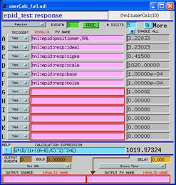
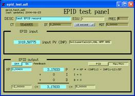
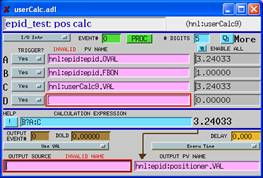

Use of the EPID record for feedback at UNICAT  
==============================================  

Pete R. Jemian  Wednesday, June 23, 2004 , 3:41:40 PM  

A swait (calculation) record was used to simulate a crystal reflection (Lorentzian peak shape) and to calculate the response of the crystal to different parameters using EPICS records. The various analog output ( ao ) records are used (by name) as inputs to the swait record. A state notation (SNL) program was written to generate Gaussian-probability (zero mean, unit standard deviation) random numbers to simulate experimental noise. The ideal position of the reflection is also adjusted by the SNL program to simulate drift in the ideal tuning position for the crystal element. An additional Gaussian random number was used to provide a small amplitude of jitter to the ideal position.  

  

An epid record provides the means to drive the pseudo-positioner in a closed feedback loop. The epid record can be operated in either a *hold constant*  (PID control) mode or a maximize (minimize) mode. In the latter mode, negative input signals will be minimized while positive signals will be maximized. Consider that the software will only maximize the absolute value of the input signal. The next screen shows a working configuration for maximizing the signal generated by the previously-shown calculation.  

  

One limitation of the epid record is that the output link must be a database link. Therefore, it must be defined in the database at boot time, although the string is changeable at run time. (Why is this?) Circumventing this presumed limitation, a swait record (next picture) has been programmed to pick up the calculation value from the epid record and pass it to the chosen positioner, provided that the epid record feedback mode has been turned on.  

  

### Comments   
Some packaging remains to be completed in order to use the epid record for routine software feedback and replace the existing software feedback. Features of that packaging might include:  
- Automatic on/off mode when input signal is out of range 
- User selection of input signal(s) 
- User selection of positioner 
- Preservation of separate tuning parameters for FMOD=PID and FMOD=Max/Min 
- When in Max/Min mode, automatic update of set point to maximum (minimum) 
- Scan of positioner through user-specified range to locate peak ( scan record?) 
- EGU, PREC, DRVH, DRVL fields come from positioner 
- Support HOPR and LOPR on the GUI screen
