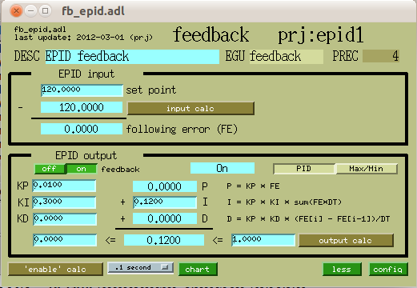
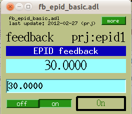
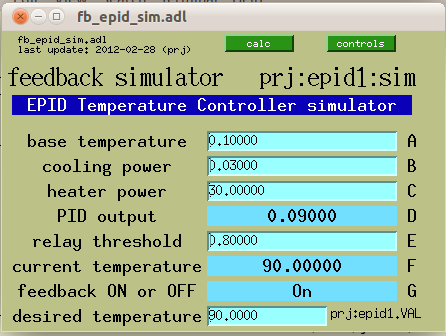
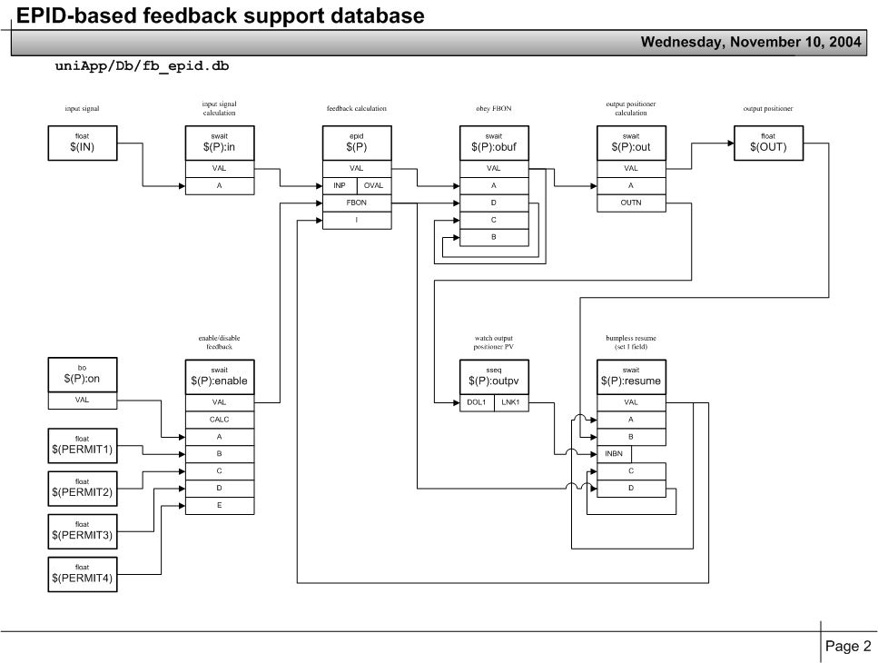

EPICS fb\_epid feedback controls
================================

| __Purpose__ | use the EPICS epid [\[2\]](#epid) record for generic software feedback |
| __Author__ | Pete R. Jemian |
| __SVN__ | $Id$ |

Contents

- [1 Overview](#overview)
    - [1.1 Theory of operation](#theory-of-operation)
- [2 Installation](#installation)
    - [2.1 modify the IOC's st.cmd file](#modify-the-ioc-s-st-cmd-file)
    - [2.2 add fb\_epid.substitutions file](#id6)
        - [2.2.1 Macro substitutions in the fb\_epid.db file](#macro-substitutions-in-the-fb-epid-db-file)
    - [2.3 modify auto\_settings.req file](#id7)
    - [2.4 add configuration to GUI to access the new support](#id8)
        - [2.4.1 Macro substitutions in the fb\_epid.adl file](#macro-substitutions-in-the-fb-epid-adl-file)
- [3 Use](#use)
    - [3.1 MEDM screens](#medm-screens)
        - [3.1.1 fb\_epid main control screen](#fb-epid-main-control-screen)
        - [3.1.2 fb\_epid basic control screen](#fb-epid-basic-control-screen)
        - [3.1.3 fb\_epid configuration screen](#fb-epid-configuration-screen)
        - [3.1.4 fb\_epid chart screen](#fb-epid-chart-screen)
        - [3.1.5 fb\_epid simulator control screen](#fb-epid-simulator-control-screen)
    - [3.2 Setup of the calculations](#setup-of-the-calculations)
        - [3.2.1 Setting the enable calculation](#setting-the-enable-calculation)
        - [3.2.2 Setting the input calculation](#setting-the-input-calculation)
        - [3.2.3 Setting the limits on the output](#setting-the-limits-on-the-output)
    - [3.3 Tuning of the epid record](#tuning-of-the-epid-record)
        - [3.3.1 Max/Min mode](#max-min-mode)
        - [3.3.2 PID mode](#pid-mode)
    - [3.4 Example using the simulator](#example-using-the-simulator)
    - [3.5 Example DCM feedback from X-ray Beam Position Monitor](#example-dcm-feedback-from-x-ray-beam-position-monitor)
    - [3.6 Example Monochromator feedback from beam intensity monitor](#example-monochromator-feedback-from-beam-intensity-monitor)
    - [3.7 Previous observations During Initial Development](#previous-observations-during-initial-development)
- [4 Infrastructure](#infrastructure)
    - [4.1 Structure of the EPICS Database](#structure-of-the-epics-database)
    - [4.2 Simulator](#simulator)


[1 Overview](#id13)
===================

The fb\_epid support provides a database centered around the EPICS epid [\[2\]](#epid) record. The versatility of the fb\_epid support lies in the various calculations that can be reconfigured by the user while the IOC is operating. These calculations allow the user to configure the input and output of the PID loop, as well as to apply complex conditions on when the PID loop should be allowed to drive the output or be switched off.

The fb\_epid support is part of the synApps [\[6\]](#synapps)optics [\[4\]](#optics) module.

[1.1 Theory of operation](#id14)
--------------------------------

1. A signal is provided as an EPICS process variable (macro parameter IN). The signal source can be in the same IOC with the feedback software or in another EPICS IOC available on the network. The variable should be a floating point. (In principle, it *could* be an integer but the feedback may not be so smooth.)
2. The input calculation (swait record) provides some flexibility for conditioning the input signal to the feedback.
3. An epid record provides real-time feedback and recalculate the output variable.
4. The output from the epid record is buffered by the obufcalculation which watches the Feedback ON (FBON) switch and retains the previous output value if the feedback software is switched off.
5. The output calculation allows some flexibility for conditioning the output signal to the positioner (OUT). The conditioned epid result is pushed to the positioner.
6. A positioner responds to the result from the epid record and thus further modifies the input signal.
7. The feedback can be switched on manually or automatically, subject to the logic of some other calculation (CALC). For example, a shutter closed signal could suspend feedback. In this case, the output is not driven.
8. When the feedback is switched on, the positioner should not jerk to a different position. The feedback software must be prepared to start moving the positioner from its present location.


[2 Installation](#id15)
=======================

Install one instance of this database for each feedback channel. If two different methods for feedback are desired for a given axis, create two instances of this database. See below for details of these configurations.

> Clever adjustments to the enable calculations can allow for automated switching, if that is desired. For example, at APS beam line 33ID for feedback of the DCM crystal 2 PZT, one instance would use the XBPM *y* position signal while another instance would use the D3 graphite foil intensity as input signals. Both would be configured to drive the DCM second crystal PZT. Choice of the *active* fb\_epid instance was obtained by adding values to the enable calculation, watching the FBON field of the other feedback.

Follow these steps to install the fb\_epid support:

1. [modify the st.cmd file](#modify-the-st-cmd-file)
2. [add fb\_epid.substitutions file](#add-fb-epid-substitutions-file)
3. [modify auto\_settings.req file](#modify-auto-settings-req-file)
4. [add configuration to GUI to access the new support](#add-configuration-to-gui-to-access-the-new-support)

[2.1 modify the IOC's st.cmd file](#id16)
-----------------------------------------

To install this software, make changes in the IOC's st.cmd file, adding this line anywhere between the calls to dbLoadDatabase and iocInit:

```
### PID_based feedback
dbLoadTemplate("fb_epid.substitutions")
```


[2.2 add fb\_epid.substitutions file](#id17)
--------------------------------------------

Create the fb\_epid.substitutions file in the same directory as st.cmd with content such as:

```
file "$(OPTICS)/opticsApp/Db/fb_epid.db"
  {
    {
        P=xxx:epid1,  
        IN=xxx:epid1:sim.VAL, 
        OUT=xxx:epid1:sim.D, 
        MODE=PID,   
        CALC=A,    
        PERMIT1="xxx:epid1:on.VAL",      
        PERMIT2="",      
        PERMIT3="",      
        PERMIT4=""
    }
  }

```

### [2.2.1 Macro substitutions in the fb\_epid.db file](#id18)

There are several macro substitutions in the fb\_epid support database (fb\_epid.db) to simplify its installation .

| macro | description |
|---|---|
| $(P) | Prefix for this instance of this database. Note that $(P):in.INAN holds PV name of input PV (by default) |
| $(IN) | PV name: input signal |
| $(OUT) | PV name: output positioner |
| $(MODE) | either PID or Max/Min |
| $(CALC) | string: actual calculation to go in $(P):enable.CALC,  - 1=feedback on - 0=feedback off  A trivial value might be "A" which only watches the value of $(P):on. |
| $(PERMIT1) | PV name: boolean value to permit operations; value becomes $(P):enable.B |
| $(PERMIT2) | PV name: boolean value to permit operations; value becomes $(P):enable.C |
| $(PERMIT3) | PV name: boolean value to permit operations; value becomes $(P):enable.D |
| $(PERMIT4) | PV name: boolean value to permit operations; value becomes $(P):enable.E |


[2.3 modify auto\_settings.req file](#id19)
-------------------------------------------

To ensure that changed values will be restored after reboot, add lines such as this to the auto\_settings.req file (usually found in the same directory with the st.cmd file).

```
### PID_based feedback
file fb_epid.req P=$(P)epid1
```


[2.4 add configuration to GUI to access the new support](#id20)
---------------------------------------------------------------

Add commands to the GUI displays to call each configured instance of the fb\_epid support. Such as this *related display*widget in MEDM:

```
"related display" {
        object {
                x=10
                y=10
                width=70
                height=20
        }
        display[0] {
                label="fb_epid"
                name="fb_epid.adl"
                args="P=prj:epid1"
        }
        display[1] {
                label="simulator"
                name="fb_epid_sim.adl"
                args="P=prj:epid1,C=sim"
        }
        clr=0
        bclr=17
        label="-prj:epid1"
}
```

Or start MEDM using a command line such as:

```
medm -x -macro "P=prj:epid1" fb_epid.adl &
```

### [2.4.1 Macro substitutions in the fb\_epid.adl file](#id21)

For the MEDM provided, the macro substitutions are:

| macro | description |
|---|---|
| $(P) | Prefix for this instance of support. |


[3 Use](#id22)
==============

Once the software has been installed (IOC configured with database and autosave/restore configured to retain settings across restarts of the IOC), some careful setup needs to happen before the software is ready to be used.

First, it is necessary to identify the EPICS PVs for the control variable (such as a positioner or the power to a heating element) and the signal variable (the PV that is sampled for the PID loop). These may have been configured in the IOC but it is possible to change them while the IOC is running. They can be changed without need to recompile or restart the EPICS IOC.

To avoid any unexpected consequences, be sure the fb\_epidsoftware is switched off before changing any PVs or changing between modes of operation. In the MEDM screen, in the EPID output section, press the button marked off.

It is most important to make sure that the input signal is updated faster than the recalculation interval for the fb\_epidsoftware or instability will occur. A factor of 3 to 10 input updates per output update is reasonable. The output will be updated each time the epid is processed.

[3.1 MEDM screens](#id23)
-------------------------

The features of the fb\_epid software are accessed from the main control screen in MEDM: fb\_epid.adl. Controls for the [Simulator](#simulator) are provided from a fb\_epid\_sim.adl screen.

### [3.1.1 fb\_epid main control screen](#id24)

The MEDM screen provides access to all the controls of the epid [\[2\]](#epid) record. To add some flexibility for configuration at run time by beam line users, an EPICS interface database has been created. The user can change the input variable(s) through a calculation (swait [\[5\]](#swait) record).

  
Figure: Main fb\_epid control screen


Control of the output variable will be permitted between the software limits shown at the bottom of the control screen. From the output calc, it is possible to change the PV which will be directed by this database.

The enable calculation can be used to provide automated on/off features with details specific to the particular installation.


### [3.1.2 fb\_epid basic control screen](#id25)

There are many controls on the main screen. For routine operations, it may be more desirable to display just the basic controls (and less of the tuning infrastructure).

  
Figure: Basic fb\_epid control screen


### [3.1.3 fb\_epid configuration screen](#id26)

The configuration screen provides top-level access to the main components that must be addressed for basic configuration. Note that advanced situations must use the calculation screens to access the complete interfaces of the swait records.

  
Figure: fb\_epid configuration screen


Caution!

The buttons marked *output buffer calc* and *resume calc* in the lower right corner are for internal use only. __Do not change anything on these screens.__


### [3.1.4 fb\_epid chart screen](#id27)

The chart screen provides a view to the recent progress. There are two strip charts (value v. time). The upper chart shows the set point (.VAL) and current value (.CVAL). The lower chart shows the following error (.ERR).

Note

The limits on the two charts need to be set before this screen is of any real use. Right-click and select "PV limits" from the pop-up menu. Don't forget to apply any changes.


  
Figure: fb\_epid configuration screen


### [3.1.5 fb\_epid simulator control screen](#id28)

The main control screen for the [Simulator](#simulator) is shown:

  
Figure: fb\_epid temperature simulator controls


[3.2 Setup of the calculations](#id29)
--------------------------------------

As stated above, the versatility of the fb\_epid support lies in the various calculations that can be reconfigured by the user while the IOC is operating.

### [3.2.1 Setting the enable calculation](#id30)

The operation of fb\_epid is permitted when the result of the enable calculation is 1.0. The first, obvious, choice is that bo record is provided to the user to switch the fb\_epid software on and off. But the software should also disable itself when the input signal goes out of range or also due to some other operating parameters.

> Other factors can be built into the enable calculation. For example, on undulator beam lines, it is not useful to run the feedback if the undulator is not operating (gap is closed or magnets are energized). In such a case, monitor the PV for the undulator gap (APS undulator A) and enable only if the gap is below some reasonable number such as 50 mm.

One should also factor the fb\_epid input signal into the enable calculation by checking that is within a valid operating range.


### [3.2.2 Setting the input calculation](#id31)

It is possible to perform limited math on the input signal to be used. For example, when the goal is to maximize the conductance through a crystal pair, such as a monochromator, the best signal would be a ratio between detector immediately before and after the pair of crystals. The control variable would be the rotation angle of either of the two crystals (usually a fine rotation of the second crystal). The input calculation would then monitor the PVs for both detectors and calculate the ratio of the two: A/B. In this example, it would also be useful to include the PV of this calculation in the enable calculation and ensure that the ratio is acceptable.


### [3.2.3 Setting the limits on the output](#id32)

To prevent the epid record from driving the control variable out of bounds, there are limits for low and high (using the epid record's .DRVL and .DRVH field). The epid record software will not allow the positioner to drive outside of these limits.


[3.3 Tuning of the epid record](#id33)
--------------------------------------

In the epid record documentation [\[2\]](#epid), there is a special discussion on feedback tuning in PID mode. Refer to the documentation for more information on the EPICS epid record.

The epid record can run in either Max/Min or PID mode. Max/Min is used to maximize a positive input signal or minimize a negative input signal such as from a beam line detector. PID mode is used to keep the input signal at constant value such as holding a sample's temperature constant.

### [3.3.1 Max/Min mode](#id34)

Max/Min mode is useful for monochromator feedback or other situations where a positive signal is to be maximized (or a negative signal is to be minimized). The online epid record documentation is lacking details about this mode so one is referred to inspecting the source code [\[3\]](#epid-source).

Note

In Max/Min mode, the Set Point is ignored.


### [3.3.2 PID mode](#id35)

PID mode is useful for holding the input signal to the *Set Point* by adjusting the control variable. The epid record documentation provides a good description of how to set the PID constants.


[3.4 Example using the simulator](#id36)
----------------------------------------

An example demonstrating the simulator is provided in the [simulator documentation](simulator.html).


[3.5 Example DCM feedback from X-ray Beam Position Monitor](#id37)
------------------------------------------------------------------

Consider the case of an X-ray beam line with a double crystal monochromator (DCM) and an X-ray Beam Position Monitor (XBPM) after the DCM. The XBPM provides a signal that can be used to maintain the throughput of the DCM if the DCM allows an adjustment of either first or second crystal Bragg rotation independent of the other crystal.

For synchrotron beam lines, the vertical position from the XBPM provides the input signal to the epid loop. The DCM often has a piezoelectric transducer (PZT) that is used to control the fine rotation of the second crystal. The second crystal rotation is controlled by a low voltage (such as -2 .. +9 VDC) sent to the PZT's amplifier. (The purpose of this amplifier is to supply the operating voltage to the PZT and optionally account for the hysteresis of the PZT as used in positioner applications.)

This example shows the startup configuration used to maintain the XBPM vertical beam position by controlling the DCM second crystal PZT voltage.

| macro | configured value | meaning |
|---|---|---|
| P | iad:fbe:xbpm:y | PV of this fb\_epid instance |
| IN | iad:xbpm:pos:y | Y position from the XBPM |
| OUT | iad:540:c0:out0 | control voltage of the PZT |
| MODE | PID | hold position steady using PID |
| CALC | A&amp;&amp;B&amp;&amp;C | only when EPID is ON and both permits |
| PERMIT1 | iad:beamAvailable.VAL | require X-ray beam to be ready |
| PERMIT2 | iad:xbpm:current:ok.VAL | require XBPM signal to be valid |
| PERMIT3 |  | unused |
| PERMIT4 |  | unused |


[3.6 Example Monochromator feedback from beam intensity monitor](#id38)
-----------------------------------------------------------------------

Consider another beam line with a DCM and then a monitor of the beam intensity (reported as a floating-point or large integer number). A list of suitable such monitors might include ionization chambers graphite foils, or fluorescent materials with photodiodes.

| macro | configured value | meaning |
|---|---|---|
| P | iad:fbe:D3:y | PV of this fb\_epid instance |
| IN | iad:540:c0:in10 | signal from the beam intensity monitor |
| OUT | iad:540:c0:out0 | control voltage of the PZT |
| MODE | Max/Min | maximize beam intensity |
| CALC | A&amp;&amp;B | only when EPID is ON and one permit |
| PERMIT1 | iad:beamAvailable.VAL | require X-ray beam to be ready |
| PERMIT2 |  | unused |
| PERMIT3 |  | unused |
| PERMIT4 |  | unused |


[3.7 Previous observations During Initial Development](#id39)
-------------------------------------------------------------

Notes from the early stages of development show motivations for the construction of this database support.

1. [Notes from initial epid record testing in 2004-06](tests/index.html)
2. [Early notes on the fb\_epid support from 2004-06](docv1.html)


[4 Infrastructure](#id40)
=========================

The fb\_epid support consists of several components:

| file | description |
|---|---|
| opticsApp/Db/fb\_epid.db | EPICS database |
| opticsApp/Db/fb\_epid.req | request file for autosave/restore |
| opticsApp/Db/epid.req | request file for autosave/restore |
| iocBoot/iocAny/fb\_epid.substitutions | creates specific instances |
| opticsApp/op/adl/fb\_epid.adl | main MEDM screen |
| opticsApp/op/adl/fb\_epid\_basic.adl | basic MEDM screen |
| opticsApp/op/adl/fb\_epid\_chart.adl | charts VAL and CVAL, also ERR |
| opticsApp/op/adl/fb\_epid\_config.adl | simplified configuration screen |
| opticsApp/op/adl/fb\_epid\_sim.adl | simulator controls |
| documentation/fb\_epid/index.html | documentation |

[4.1 Structure of the EPICS Database](#id41)
--------------------------------------------

The EPICS database was constructed in 2004. The records of the database are defined in this table:

| record type | name | description |
|---|---|---|
| epid | $(P) | Epid record instance |
| swait | $(P):in | Input signal collector |
| swait | $(P):obuf | Enforces $(P).FBON to disconnect epid record from output so $(OUT) is not changed |
| swait | $(P):out | Output signal collector |
| sseq | $(P):outpv | Part of bumpless start feature |
| swait | $(P):resume | Part of bumpless start feature |
| bo | $(P):on | User switch to turn epid ON or OFF |
| swait | $(P):enable | Automatic ON/OFF feature |
| swait | $(P):sim | Simulated temperature reading and heater |

A figure was produced to show how these records are connected. Note that the simulator record ($(P):sim)is not shown in this figure.

Figure: Structure of the fb\_epid database


The database file has many comments. The text of the file is included here:

```
########### SVN repository information ###################
# $Date$
# $Author$
# $Revision$
# $URL$
# $Id$
########### SVN repository information ###################
#
# file:     fb_epid.db
# purpose:  use the epid record for software feedback

#------------------------------------------
#  P    prefix for this instance of this database
#------------------------------------------
#  $(P):in.INAN        holds PV name of input PV (by default)
#  $(IN)               PV name: input signal
#  $(OUT)              PV name: output positioner
#  $(MODE)             choice:  PID or Max/Min
#  $(CALC)             string:  calculation, 1=feedback on, 0=feedback off
#  $(PERMIT1)          PV name: boolean value to permit operations
#  $(PERMIT2)          PV name: boolean value to permit operations
#  $(PERMIT3)          PV name: boolean value to permit operations
#  $(PERMIT4)          PV name: boolean value to permit operations

# Use on instance of this database for each feedback channel.
# If two different methods for feedback are desired
# for a given axis, call two instances of this database.
# For example, on 33ID for feedback of the DCM crystal 2 PZT,
#  one might choose either the XBPM position signal or the 
#  D3 graphite foil intensity to drive the PZT position.
#
#  These might be the XBPM position feedback terms:
#    P       = iad:fbe:xbpm:y
#    IN      = iad:xbpm:pos:y
#    OUT     = iad:540:c0:out0
#    MODE    = PID
#    CALC    = A&&B&&C
#    PERMIT1 = iad:beamAvailable.VAL
#    PERMIT2 = iad:xbpm:current:ok.VAL
#    PERMIT3 = 
#    PERMIT4 = 
#
#  These might be the D3 foil feedback terms:
#    P       = iad:fbe:D3:y
#    IN      = iad:540:c0:in10
#    OUT     = iad:540:c0:out0
#    MODE    = Max/Min
#    CALC    = A&&B
#    PERMIT1 = iad:beamAvailable.VAL
#    PERMIT2 = 
#    PERMIT3 = 
#    PERMIT4 = 

# For each channel:
#  signal(ao or other)
#    -> in(swait)
#    --> epid
#    ---> obuf(swait) 
#    ----> out(swait)
#    -----> positioner(motor or ao)

# Theory of operation:
# 1. A signal is available as an EPICS process variable.
#    The signal source can be in the VME with the feedback software
#    or in another VME available on the local network.
# 2. An input calculation (swait record) is used to allow some
#    flexibility for conditioning the input signal to the feedback.
# 3. An epid record is used to provide real-time feedback
#    and recalculate the output variable.
# 4. The output from the epid record is buffered by
#    the outbuf calculation which watches the Feedback ON (FBON)
#    switch and retains the previous output value if the feedback
#    software is switched off.
# 5. An output calculation is used to allow some flexibility
#    for conditioning the output signal to the positioner.
#    The conditioned epid result is pushed to the positioner.
# 6. A positioner responds to the result from the epid record
#    and thus further modifies the input signal.
# 7. The feedback can be switched on manually, subject to
#    the logic of some other calculation.  For example,
#    shutter closed could suspend feedback.  In this case,
#    the output is not driven.
# 8. When the feedback is switched on, the positioner should
#    not jerk to a different position.  The feedback software
#    must be prepared to start moving the positioner from its 
#    present location.

# References
#  epid          http://cars9.uchicago.edu/software/epics/epidRecord.html
#  swait         http://www.aps.anl.gov/bcda/synApps/calc/swaitRecord.html
#  PID tuning    see the epid documentation (above)

#------------------------------------------

   #
   # epid record to actually calculate the 
   # feedback response to the input
   #
grecord(epid, "$(P)") {
        field(DESC, "EPID feedback")
        field(INP,  "$(P):in")
        field(FMOD, "$(MODE)")
        field(FBON, "Off")
        field(SCAN, "Passive")
        field(KP,   "0")
        field(KI,   "0")
        field(KD,   "0")
        field(I,    "0")
        field(DRVL, "0")
        field(DRVH, "0")
        field(EGU,  "feedback")
        field(PREC, "4")
}
   #
   # Input calculation to the epid record
   # Users can adjust the input based on a simple calculation
   # or a more complex database resulting in this simple calculation
   # By default, $(P):in.INAN is the PV name of the input signal
   #
grecord(swait, "$(P):in") {
        field(DESC, "EPID feedback input")
        field(PREC, "5")
        field(SCAN, "I/O Intr")
        field(CALC, "A")
        field(INAN, "$(IN)")
        field(INAP, "1")
}
   #
   # Output buffer from epid record
   # This record overcomes a limitation observed in the 
   # epid record when $(P).FBON=0 but $(P).OVAL is changed anyway.
   # In this record, $(P):obuf.VAL will not change when $(P).FBON=0
   #
grecord(swait, "$(P):obuf") {
        field(DESC, "EPID FBON output buffer")
        field(PREC, "5")
        field(SCAN, "I/O Intr")
        field(CALC, "B?A:C")
        field(INAN, "$(P).OVAL")
        field(INAP, "1")
        field(INBN, "$(P).FBON")
        field(INBP, "1")
        field(INCN, "$(P):obuf.VAL")
        field(INCP, "1")
}
   #
   # Provide the output from the epid record (through the output buffer)
   # The intent here is to provide the user with a means
   # of modifying the output signal from the epid record.
   # Whether or not this is a good idea remains to be seen.
   # This record pulls the value from $(P):obuf
   # $(P):out.OUTN holds the PV name of the output positioner.
   #
   # Instead, could make this a seq record, eliminating the calculation.
   #
grecord(swait, "$(P):out") {
        field(DESC, "EPID feedback output")
        field(PREC, "5")
        field(SCAN, "I/O Intr")
        field(CALC, "A")
        field(INAN, "$(P):obuf.VAL")
        field(INAP, "1")
        field(OUTN, "$(OUT)")
}

   #
   # bumpless start feature
   #
   # When $(P).FBON transitions from 0 to 1 (as feedback starts up),
   # it is necessary to grab the current value of the
   # output positioner and push it into $(P).I
   # However, since the user might change $(P):out.OUTN,
   # $(P):outpv detects this change and rewrites $(P):resume.INBN.
   # $(P):resume.INBN holds the PV name of the output positioner
   #
grecord(sseq, "$(P):outpv") {
        field(DESC, "follow OUT PV name")
        field(SCAN, "I/O Intr")
        field(DOL1, "$(P):out.OUTN")
        field(DLY1, "0")
        field(LNK1, "$(P):resume.INBN")
}
grecord(swait, "$(P):resume") {
        field(DESC, "EPID feedback input")
        field(PREC, "5")
        field(SCAN, "I/O Intr")
        field(CALC, "!C&&D?B:A")
        field(INAN, "$(P):resume.VAL")
        field(INAP, "1")
        field(INBN, "$(OUT)")
        field(INBP, "1")
        field(INCN, "$(P):resume.D")
        field(INCP, "0")
        field(INDN, "$(P).FBON")
        field(INDP, "1")
        field(OOPT, "On Change")
        field(OUTN, "$(P).I")
}

   #
   # permit
   #
   # Sometimes, the feedback software must be suspended.
   # This must happen automatically, based on some 
   # simple calculation or a more complex database 
   # resulting in this simple calculation.
   # $(P):enable drives the $(P).FBON field
   #
grecord(bo, "$(P):on")
{
        field(DESC, "off/on")
        field(ZNAM, "off")
        field(ONAM, "on")
}
grecord(swait, "$(P):enable") {
        field(DESC, "EPID feedback permit")
        field(PREC, "5")
        field(SCAN, "I/O Intr")
        field(CALC, "A&&B")
        field(INAN, "$(P):on.VAL")
        field(INAP, "1")
        field(INBN, "$(PERMIT1)")
        field(INBP, "1")
        field(INCN, "$(PERMIT2)")
        field(INCP, "1")
        field(INDN, "$(PERMIT3)")
        field(INDP, "1")
        field(INEN, "$(PERMIT4)")
        field(INEP, "1")
        field(OOPT, "On Change")
        # drive the epid FBON field
        field(OUTN, "$(P).FBON")
}


#--------------------------------------------
# simulate a temperature sensor and heater
#----------------------
# A : minimum "temperature" allowed
# B : cooling rate parameter
# C : heater power
# D : output of PID loop
# E : heater relay closes when D > E
# F : current "temperature"
#----------------------
# PID loop terms:
#   $(P):in.INAN = "$(P):sim"
#   $(P):out.OUTN = "$(P):sim.D"
#   $(P):enable.INAN = "$(P):on.VAL"
#   $(P).KP = "0.01"
#   $(P).KI = "0.1"
#   $(P).I = "0.0"
#   $(P).KD = "0.0"
#   $(P).DRVL = "0.0"
#   $(P).DRVH = "1.0"
#   $(P).FMOD = "PID"
#----------------------
grecord(swait, "$(P):sim") {
        field(DESC, "EPID Temperature Controller simulator")
        field(PREC, "5")
        field(SCAN, ".1 second")
        field(CALC, "max(A,F*(1-B)+C*D*G)")
        field(A,    "0.1")      # minimum "temperature"
        field(B,    "0.05")     # cooling rate parameter
        field(C,    "30")       # heater power
        field(D,    "0")        # driven by epid loop
        field(E,    "0.8")      # relay close threshold
        field(INFN, "$(P):sim.VAL")
        field(INGN, "$(P).FBON")# is feedback ON?
}

```


[4.2 Simulator](#id42)
----------------------

To help learn how to use the fb\_epid support, an swait record was added to simulate the temperature reading of an object that is exposed to some cooling power. A heater with adjustable power may applied, either as adjustable power or as a switched power.

Documentation of the simulator is provided on a [related page](simulator.html).

Footnotes

* \[1\] - EPICS calc Record: [http://www.aps.anl.gov/bcda/synApps/calc/calcDocs.html](http://www.aps.anl.gov/bcda/synApps/calc/calcDocs.html) 
* \[2\] - *([1](#id1), [2](#id3), [3](#id9), [4](#id11))* EPICS epid Record: [http://cars9.uchicago.edu/software/epics/epidRecord.html](http://cars9.uchicago.edu/software/epics/epidRecord.html) 
* \[3\] - epid source code: [https://subversion.xray.aps.anl.gov/trac/synApps/browser/std/trunk/stdApp/src/devEpidSoft.c](https://subversion.xray.aps.anl.gov/trac/synApps/browser/std/trunk/stdApp/src/devEpidSoft.c) 
* \[4\] - *([1](#id2), [2](#id5))* EPICS synApps optics module: [http://www.aps.anl.gov/bcda/synApps/optics/opticsDocs.html](http://www.aps.anl.gov/bcda/synApps/optics/opticsDocs.html) 
* \[5\] - EPICS swait Record: [http://www.aps.anl.gov/bcda/synApps/calc/swaitRecord.html](http://www.aps.anl.gov/bcda/synApps/calc/swaitRecord.html) 
* \[6\] - EPICS synApps: [http://www.aps.anl.gov/bcda/synApps](http://www.aps.anl.gov/bcda/synApps) |


- - - - - -
