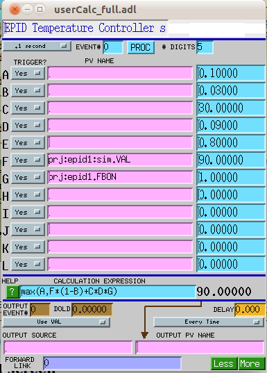

fb\_epid simulator
==================

| __Purpose__ | describe the simulator in the fb\_epid support |
|---|---|
| __Author__ | Pete R. Jemian |
| __SVN__ | $Id: simulator.rst 14555 2012-03-02 20:21:10Z jemian $ |

Contents

- [1 Example use of the fb\_epid simulator](#example-use-of-the-fb-epid-simulator)
    - [1.1 Interface Screens](#interface-screens)
    - [1.2 Operation](#operation)


[1 Example use of the fb\_epid simulator](#id2)
===============================================

The support database has a simulator to help learn how to use the fb\_epid support. The simulator models the temperature of something which is subject to some cooling. There is support for heating power to be applied, as directed by the output of the epid record. The cooling could be applied either by adjustment of a continuous variable or by a (simulated) relay-switched application of heating power. Smoother operation is obtained with the continuous variable but not all temperature controllers provide this.

The simulator is based on the swait record. [\[1\]](#swait)The fields are assigned as follows:

| field | description |
|---|---|
| A | minimum "temperature" allowed |
| B | cooling rate parameter |
| C | heater power |
| D | output of PID loop |
| E | heater relay closes when D &gt; E |
| F | current "temperature" |

The fb\_epid support should be configured like this:

| PV | value |
|---|---|
| $(P):in.INAN | $(P):sim |
| $(P):out.OUTN | $(P):sim.D |
| $(P):enable.INAN | $(P):on.VAL |
| $(P).KP | 0.01 |
| $(P).KI | 0.1 |
| $(P).I | 0.0 |
| $(P).KD | 0.0 |
| $(P).DRVL | 0.0 |
| $(P).DRVH | 1.0 |
| $(P).FMOD | PID |

This configuration is defined in the supplied fb\_epid.substitutions file.

```
<pre class="literal-block">
# $Id: fb_epid.substitutions 14504 2012-02-29 21:11:18Z jemian $

file "$(OPTICS)/opticsApp/Db/fb_epid.db"
  {
    {
        P=xxx:epid1,  
        IN=xxx:epid1:sim.VAL, 
        OUT=xxx:epid1:sim.D, 
        MODE=PID,   
        CALC=A,    
        PERMIT1="xxx:epid1:on.VAL",      
        PERMIT2="",      
        PERMIT3="",      
        PERMIT4=""
    }
  }

```

[1.1 Interface Screens](#id3)
-----------------------------

start a MEDM session with a command such as:

```
<pre class="literal-block">
medm -x -macro "P=prj:epid1,C=:sim" fb_epid_sim.adl &
```

This screen provides access to the simulator, the swait calculation record, and the fb\_epid controls that support it.

Figure: fb\_epid temperature simulator controls


The calc button brings up this screen:

Figure: temperature simulator calculation


The controls button brings up the standard fb\_epid controls:

Figure: fb\_epid` main control screen


[1.2 Operation](#id4)
---------------------

to be written

Footnotes

| [\[1\]](#id1) | EPICS swait record: [http://www.aps.anl.gov/bcda/synApps/calc/swaitRecord.html](http://www.aps.anl.gov/bcda/synApps/calc/swaitRecord.html) |
|---|---|


- - - - - -

[View document source](simulator.rst). Generated on: 2012-03-02.
