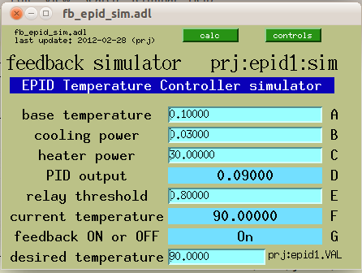
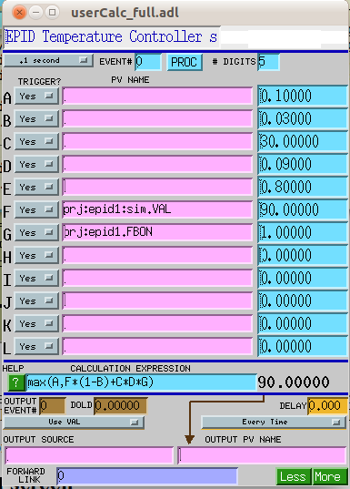
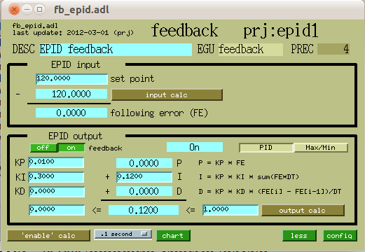

# fb\_epid Simulator
{: .no_toc}

## Table of contents
{: .no_toc .text-delta }

- TOC
{:toc}

Overview
--------

The support database includes a simulator to help learn how to use
the fb\_epid support. The simulator models the temperature of an
object which is subject to cooling. Heating power can be applied as
directed by the output of the epid record. The cooling can be applied
either by adjustment of a continuous variable or by a (simulated)
relay-switched application of heating power. Smoother operation is
obtained with the continuous variable but not all temperature
controllers provide this.

The simulator is based on the
[swait](https://epics.anl.gov/bcda/synApps/calc/swaitRecord.html)
record. The fields are assigned as follows:

| Field | Description |
| - | - |
| A | Minimum "temperature" allowed |
| B | Cooling rate parameter |
| C | Heater power |
| D | Output of PID loop |
| E | Heater relay closes when D > E |
| F | Current "temperature" |

Configuration
-------------

The fb\_epid support should be configured like this:

| PV | Value |
| - | - |
| `$(P):in.INAN` | `$(P):sim` |
| `$(P):out.OUTN` | `$(P):sim.D` |
| `$(P):enable.INAN` | `$(P):on.VAL` |
| `$(P).KP` | 0.01 |
| `$(P).KI` | 0.1 |
| `$(P).I` | 0.0 |
| `$(P).KD` | 0.0 |
| `$(P).DRVL` | 0.0 |
| `$(P).DRVH` | 1.0 |
| `$(P).FMOD` | PID |

This configuration is defined in the supplied
`fb_epid.substitutions` file:

```
file "$(OPTICS)/opticsApp/Db/fb_epid.db"
  {
    {
        P=xxx:epid1,
        IN=xxx:epid1:sim.VAL,
        OUT=xxx:epid1:sim.D,
        MODE=PID,
        CALC=A,
        PERMIT1="xxx:epid1:on.VAL",
        PERMIT2="",
        PERMIT3="",
        PERMIT4=""
    }
  }
```

Interface Screens
-----------------

Start a MEDM session with a command such as:

```
medm -x -macro "P=prj:epid1,C=:sim" fb_epid_sim.adl &
```

This screen provides access to the simulator, the swait calculation
record, and the fb\_epid controls that support it.



The **calc** button brings up the simulator calculation screen:



The **controls** button brings up the standard fb\_epid controls:


