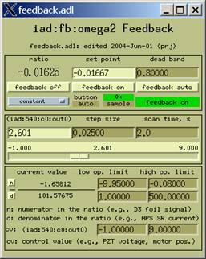
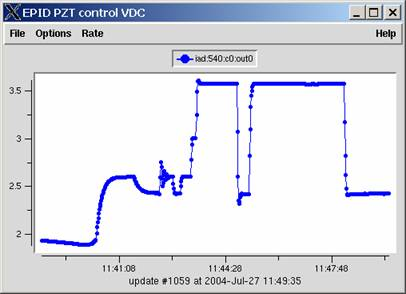
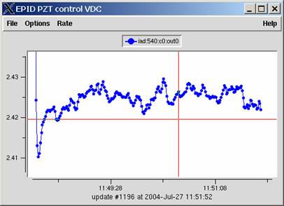
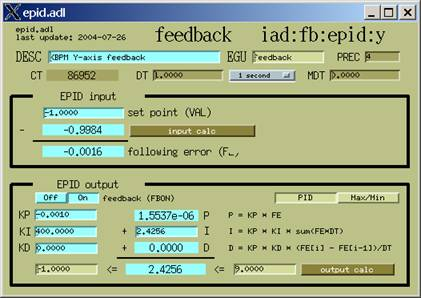
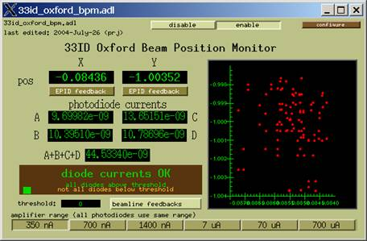
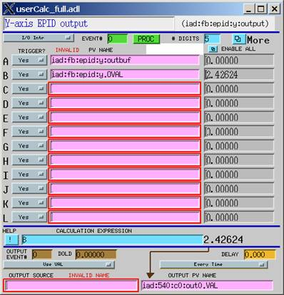

2004 July 27  Observations
==========================

While first using the EPID record as the internal component in a feedback loop on 33ID maintaining the Oxford X-ray beam position monitor by adjusting the DCM omega2 piezo control voltage.  

  
  
  

Feedback on the vertical position looks promising using the EPID record. Response is quite good, taking about 10 seconds to lock in to a new position 1 mm away from the current position. Position noise is observed when the PZT is moved, otherwise, operation is quieter than with the standard feedback. 

  

The set point is the XBPM position to hold.  KP = -0.001 (Note that KP is negative.)  KI = 400  KD = 0  With a positive KP, then the feedback drives *away*  from the set point.  No KD term is needed. KI term of 1000 produced ringing (which damped in about 10 cycles) when set point was changed.  KI=400 produces a mild overshoot.  Before FBON is set to ON, I term should be loaded with the current value of the positioner. Otherwise, the positioner *will* jump. Likewise, the limits DRVL and DRVH should be preloaded from the positioner. 

   

