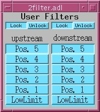
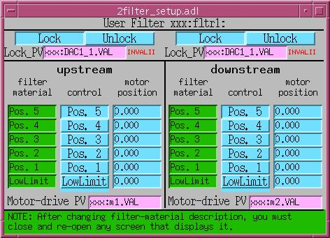
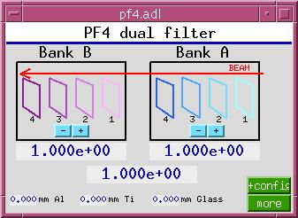
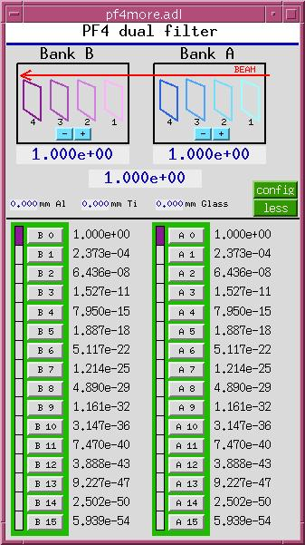
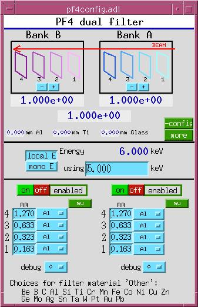
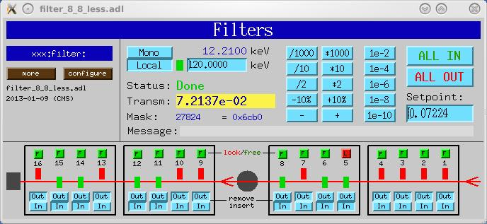
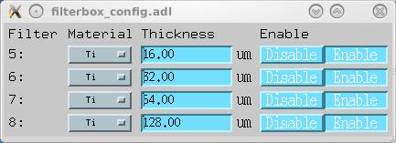

# Filters
{: .no_toc}

## Table of contents
{: .no_toc .text-delta }

- TOC
{:toc}

Motor-Driven Filters
---------------------

`filterMotor.db` provides basic motor-driven filter support, using
motor records to position individual filter blades in or out of the
beam path. The related database `filterLock.db` provides interlock
functionality to prevent filter changes during data acquisition.

XIA PF4 Dual Filter
--------------------

| 2filter.adl | 2filter\_setup.adl |
|:---:|:---:|
|  |  |

This software treats two XIA (X-Ray Instrumentation Associates) PF4
four-filter units as separate devices, though it does calculate the
total transmission of the two units. Originally, this software
supported only three filter-material choices, but support for 22
elemental filter materials was grafted on later. This software drives
the filter via digital I/O PVs. It also monitors those PVs, and
behaves correctly when they are changed by some external agent.

This software calculates the x-ray transmission for each combination
of filters in one unit, given the current x-ray beam energy, and
permits either direct setting of the desired transmission, or
selection of the next higher, or next lower, transmission.

  

### Loading the database

Add the following lines to the IOC startup file (`st.cmd`) before
`iocInit()`:

```
### Load database records for dual PF4 filters
dbLoadRecords("$(OPTICS)/opticsApp/Db/pf4common.db","P=xxx:,H=pf4:,A=A,B=B")
dbLoadRecords("$(OPTICS)/opticsApp/Db/pf4bank.db","P=xxx:,H=pf4:,B=A")
dbLoadRecords("$(OPTICS)/opticsApp/Db/pf4bank.db","P=xxx:,H=pf4:,B=B")
```

Add the following lines after `iocInit()`:

```
# Start PF4 filter sequence program
#        name = what user will call it
#        P    = prefix of database and sequencer
#        H    = hardware (i.e. pf4)
#        B    = bank indicator (i.e. A,B)
#        M    = Monochromatic-beam energy PV
#        BP   = Filter control bit PV prefix
#        B1   = Filter control bit 0 number
#        B2   = Filter control bit 1 number
#        B3   = Filter control bit 2 number
#        B4   = Filter control bit 3 number
seq &pf4,"name=pf1,P=xxx:,H=pf4:,B=A,M=xxx:BraggEAO,BP=xxx:Unidig1Bo,B1=3,B2=4,B3=5,B4=6"
seq &pf4,"name=pf2,P=xxx:,H=pf4:,B=B,M=xxx:BraggEAO,BP=xxx:Unidig1Bo,B1=7,B2=8,B3=9,B4=10"
```

### Autosave configuration

Add the following lines to `auto_settings.req`:

```
## PF4 dual filter
file pf4common.req P=$(P),H=pf4:
file pf4bank.req   P=$(P),H=pf4:,B=A
file pf4bank.req   P=$(P),H=pf4:,B=B
```

XIA PF4 Multiple Filter
------------------------

This software treats two or four XIA PF4 four-filter units as a
single device. It drives the filters via digital I/O PVs. It also
monitors those PVs, and behaves correctly when they are changed by
some external agent.

This software calculates the x-ray transmission for all combinations
of all filters in all units, given the current x-ray beam energy. It
permits direct setting of the desired transmission, setting the
transmission relative to the current value (e.g., down by 10%, up by
a factor of 2, etc.), and selection of the next higher, or next
lower, transmission. It also permits individual filters to be removed
from consideration, and locked in or out of the x-ray beam.

| filter.adl | filterbox\_config.adl |
|:---:|:---:|
|  |  |

### Loading the database

Add the following lines to the IOC startup file (`st.cmd`) before
`iocInit()`:

```
### Load database records for alternative PF4-filter support
dbLoadTemplate "filter.substitutions"
```

Add the following lines after `iocInit()`:

```
# Alternative pf4 filter seq program
seq filterDrive,"NAME=filterDrive,P=xxx:,R=filter:,NUM_FILTERS=16"
```

Here is a sample `filter.substitutions` file:

```
# filter.substitutions

file "$(OPTICS)/opticsApp/Db/filterBladeNoSensor.db" {
  pattern
  {P,           R,        N,   DESC,           OUT}
  {xxx:,   filter:,  1,   "Filter 1",     "xxx:Unidig1Bo0"}
  {xxx:,   filter:,  2,   "Filter 2",     "xxx:Unidig1Bo1"}
  {xxx:,   filter:,  3,   "Filter 3",     "xxx:Unidig1Bo2"}
  {xxx:,   filter:,  4,   "Filter 4",     "xxx:Unidig1Bo3"}
  {xxx:,   filter:,  5,   "Filter 5",     "xxx:Unidig1Bo4"}
  {xxx:,   filter:,  6,   "Filter 6",     "xxx:Unidig1Bo5"}
  {xxx:,   filter:,  7,   "Filter 7",     "xxx:Unidig1Bo6"}
  {xxx:,   filter:,  8,   "Filter 8",     "xxx:Unidig1Bo7"}
  {xxx:,   filter:,  9,   "Filter 9",     "xxx:Unidig1Bo8"}
  {xxx:,   filter:,  10,  "Filter 10",    "xxx:Unidig1Bo9"}
  {xxx:,   filter:,  11,  "Filter 11",    "xxx:Unidig1Bo10"}
  {xxx:,   filter:,  12,  "Filter 12",    "xxx:Unidig1Bo11"}
  {xxx:,   filter:,  13,  "Filter 13",    "xxx:Unidig1Bo12"}
  {xxx:,   filter:,  14,  "Filter 14",    "xxx:Unidig1Bo13"}
  {xxx:,   filter:,  15,  "Filter 15",    "xxx:Unidig1Bo14"}
  {xxx:,   filter:,  16,  "Filter 16",    "xxx:Unidig1Bo15"}
}

file "$(OPTICS)/opticsApp/Db/filterDrive.db" {
  {P="xxx:", R="filter:", DESC="Filters", KEV="xxx:BraggEAO"}
}
```

### Autosave configuration

Add the following to `auto_settings.req`:

```
file filterDrive.req "P=xxx:,R=filter:"
file filterBladeNoSensor.req "P=xxx:,R=filter:,N=1"
file filterBladeNoSensor.req "P=xxx:,R=filter:,N=2"
file filterBladeNoSensor.req "P=xxx:,R=filter:,N=3"
file filterBladeNoSensor.req "P=xxx:,R=filter:,N=4"
file filterBladeNoSensor.req "P=xxx:,R=filter:,N=5"
file filterBladeNoSensor.req "P=xxx:,R=filter:,N=6"
file filterBladeNoSensor.req "P=xxx:,R=filter:,N=7"
file filterBladeNoSensor.req "P=xxx:,R=filter:,N=8"
file filterBladeNoSensor.req "P=xxx:,R=filter:,N=9"
file filterBladeNoSensor.req "P=xxx:,R=filter:,N=10"
file filterBladeNoSensor.req "P=xxx:,R=filter:,N=11"
file filterBladeNoSensor.req "P=xxx:,R=filter:,N=12"
file filterBladeNoSensor.req "P=xxx:,R=filter:,N=13"
file filterBladeNoSensor.req "P=xxx:,R=filter:,N=14"
file filterBladeNoSensor.req "P=xxx:,R=filter:,N=15"
file filterBladeNoSensor.req "P=xxx:,R=filter:,N=16"
```

### Display files

Top-level MEDM display files for this support:

| File | Description |
| - | - |
| `filter_8_0_more.adl` | Two PF4 4-filter units |
| `filter_8_8_more.adl` | Four PF4 4-filter units |

To load the MEDM display, specify a related display button with
entries such as:

```
Display Label: PF4 filter 16
Display File: filter_8_8_more.adl
Arguments: P=xxx:,R=filter
```
