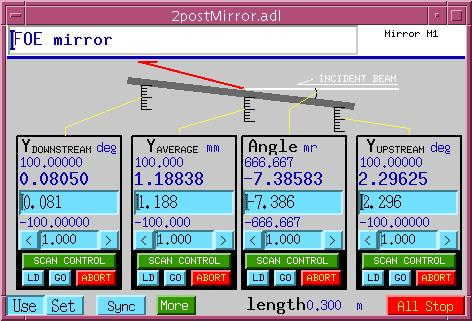

# Mirrors
{: .no_toc}

## Table of contents
{: .no_toc .text-delta }

- TOC
{:toc}

2-Post Mirror
-------------

### 2postMirror.adl



The `2postMirror.db` database provides coordinated motion support for
a mirror mounted on two posts (upstream and downstream). The database
converts between raw motor positions and four virtual axes:

| Virtual Axis | Description |
| - | - |
| Downstream | Position of the downstream post motor |
| Upstream | Position of the upstream post motor |
| Angle | Mirror angle in milliradians |
| Average | Average height of the two posts in mm |

The database includes tweak controls for each axis, set/use
calibration mode, synchronization, and a DMOV (done-moving) PV.

### Macros

| Macro | Description |
| - | - |
| `$(P)` | PV prefix |
| `$(Q)` | Mirror instance identifier |
| `$(mUp)` | Motor record name for the upstream post |
| `$(mDn)` | Motor record name for the downstream post |
| `$(LENGTH)` | Distance between the two posts (meters) |

### Loading the database

```
dbLoadRecords("$(OPTICS)/opticsApp/Db/2postMirror.db","P=xxx:,Q=M1:,mUp=m1,mDn=m2,LENGTH=0.5")
```

ASRP Mirror Table
------------------

The ASRP (Advanced Synchrotron Radiation Project) mirror table
database provides coupled pitch-angle and vertical-height control.
When a desired pitch angle is specified in milliradians, the database
calculates and drives the appropriate pitch motor and vertical motor
positions to maintain a fixed-point position on the mirror surface.

The geometry is defined by two parameters:

- **pitchArmLen** -- the distance from the pivot point to the pitch
  motor
- **fixedPointZ** -- the distance from the pivot point to the fixed
  point on the mirror surface

The transform calculations are:

```
pitch_motor = pitchArmLen * tan(pitch_angle / 1000)
height_diff = fixedPointZ * (new_pitch_motor - current_pitch_motor) / pitchArmLen
new_vert    = current_vert - height_diff
```

An `autosync` record monitors the pitch motor via Channel Access
and updates the displayed pitch angle whenever the motor is moved
externally.

### Database variants

Two versions of the ASRP mirror table database are provided:

| Database | Description |
| - | - |
| `ASRPmirrorTable.db` | Standard version. Writes the pitch angle directly to the transform record. |
| `ASRPmirrorTable_softmotor.db` | Adds a soft motor record (`coupledPitchAngle`) as an intermediate, so the coupled pitch angle can be scanned as if it were a motor. Includes `SDIS` to prevent mutual triggering between `tran` and `autosync`. |

### Macros

| Macro | Description |
| - | - |
| `$(P)` | PV prefix |
| `$(TBL)` | Mirror table instance identifier |
| `$(PITCH)` | Pitch motor PV (e.g., `xxx:m1`) |
| `$(VERT)` | Vertical motor PV (e.g., `xxx:m2`) |

### Loading the database

```
dbLoadRecords("$(OPTICS)/opticsApp/Db/ASRPmirrorTable.db","P=xxx:,TBL=MT1:,PITCH=xxx:m1,VERT=xxx:m2")
```

Or, for the soft motor version:

```
dbLoadRecords("$(OPTICS)/opticsApp/Db/ASRPmirrorTable_softmotor.db","P=xxx:,TBL=MT1:,PITCH=xxx:m1,VERT=xxx:m2")
```

After loading the database, set the geometry parameters at runtime
or via autosave:

```
# Distance from pivot to pitch motor (mm)
caput xxx:MT1:pitchArmLen 100.0
# Distance from pivot to fixed point (mm)
caput xxx:MT1:fixedPointZ 50.0
```

### Autosave configuration

Add the following to `auto_settings.req`:

```
file ASRPmirrorTable_settings.req P=$(P),TBL=MT1:
```

This saves and restores the `fixedPointZ` and `pitchArmLen` values.

### Display files

| File | Description |
| - | - |
| `ASRPmirrorTable.adl` | Full display with schematic and coupled pitch control |
| `ASRPmirrorTable_small.adl` | Compact display with pitch angle setpoint and "More" button |
