# Monochromators
{: .no_toc}

## Table of contents
{: .no_toc .text-delta }

- TOC
{:toc}

synApps supports the following monochromator types and geometries:

- Non-dispersive double-crystal with symmetric offset (Kohzu/PSL geometry 1)
- Non-dispersive double-crystal with asymmetric offset (Kohzu/PSL geometry 2)
- Non-dispersive double-crystal with Bragg and gap control
- Dispersive double-crystal -- nested geometry
- Dispersive double-crystal -- symmetric geometry
- Spherical grating
- Multilayer

Kohzu/PSL Geometry 1 (Theta, Y1, Z2)
-------------------------------------

### kohzuGraphic.adl

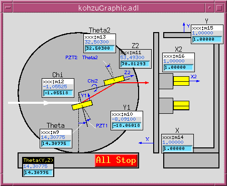

This MEDM display is a picture of Kohzu/PSL geometry 1, with white
beam entering from the left, monochromatized radiation diffracting
upward from the first crystal and then forward from the second
crystal. The crystal stages are mounted on a plate which rotates
about a point midway, vertically, between the incident and exiting
beam.

The difference in height between the incident beam and the point
about which the plate rotates is called the monochromator offset,
and the software allows this offset to be changed by a knowledgeable
developer, though not by the casual user.

{: .note }
> Users sometimes use "offset" to mean the vertical distance
> between the incident and exit beams, which is twice the offset
> as defined here.

The crystals normally translate, as the plate rotates, to keep the
first crystal in the incident beam, and to maintain the exiting beam
at constant height.

As the monochromator rotates from a Bragg angle (Theta) of zero, the
first crystal moves away from the rotation point along a line normal
to its diffracting planes, executing the equation

```
Y = -offset/cos(Theta)
```

Thus, `Y(Theta=0) = -offset`, and a positive-sense motion would move
the crystal toward the rotation point.

At the same time, the second crystal moves toward the rotation point
along a line which is parallel to the crystal's diffracting planes,
and which intersects the rotation point, according to the equation

```
Z = offset/sin(Theta)
```

Thus, a positive-sense motion of the second crystal moves it in the
direction of the exiting beam.

Because the Y and Z motions are nonlinear functions of Theta, their
speeds ideally should vary as they move. The software does not
attempt this, but it does attempt to set motor speeds to the closest
linear approximation to ideal behavior. This means that it attempts
to set motor speeds so that Theta, Y, and Z all move for the same
length of time. The attempt may not succeed, however, because the
motors have high and low speed limits, and will refuse commands to
violate them.

### kohzuSeqCtl\_All.adl

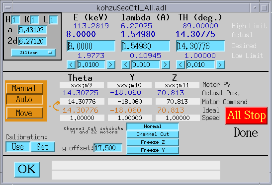

This MEDM display serves both geometries, and contains all of the
user-modifiable fields that control and set them up. Smaller, less
complicated displays are also provided.

At top left, crystal parameters are selected from a list that
includes Silicon (at room temperature, and at 77K), Germanium, and
Diamond. Miller indices can also be specified. When fields in this
section are modified, the resulting reflection is checked, and the
software is put into Manual-Move mode (described below).

The monochromator can be driven in energy, wavelength, or angle.
Undriven fields are kept consistent automatically with driven fields.

The software can be in Manual-Move, or Auto\_Move mode. In
Manual-Move mode, changes to energy, wavelength, or theta are not
sent to the motors until the user issues a "Move" command. In
Auto\_Move mode, changes to energy, wavelength, or theta are sent
to the motors without further prompting from the user.

The manner in which Y and Z motions of monochromator crystals are
calculated depends on the setting of a second mode switch, with the
following options:

| Mode | Description |
| - | - |
| Normal | Y, Z driven per equations described above |
| Channel Cut | Y, Z are left at their current positions |
| Freeze Z | Z is left at its current position |
| Freeze Y | Y is left at its current position |

{: .note }
> The display pictured above uses EPICS analog output records for
> virtual motors such as Energy, Lambda, etc. There is a second
> version of the Kohzu monochromator software that uses soft motor
> records for virtual motions. See `kohzu*soft*` in `src`, `Db`,
> and `op` directories.

Kohzu/PSL Geometry 2 (Theta, Y2, Z2)
-------------------------------------

### kohzu2Graphic.adl

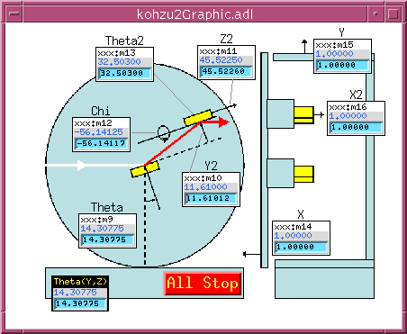

This MEDM display is a picture of Kohzu/PSL geometry 2, with white
beam entering from the left, monochromatized radiation diffracting
upward from the first crystal and then forward from the second
crystal. The crystal stages are mounted on a plate which rotates
about a point on the surface of the first crystal.

The difference in height between the entrance and exit beams is
called the monochromator offset, and the software allows this offset
to be changed by the user.

{: .note }
> This geometry's "offset" is different from that of the Kohzu 1
> geometry.

The second crystal normally translates, as the monochromator rotates,
to maintain the exiting beam at constant height.

As the monochromator rotates from a Bragg angle (Theta) of zero, the
second crystal moves upward along a line normal to its diffracting
planes, executing the equation

```
Y = -offset/(2*cos(Theta))
```

At the same time, the second crystal moves toward the rotation point
along a line which is parallel to the crystal's diffracting planes,
according to the equation

```
Z = offset/(2*sin(Theta))
```

Thus, a positive-sense motion of the second crystal moves it in the
direction of the exiting beam.

Because the Y and Z motions are nonlinear functions of Theta, their
speeds ideally should vary as they move. The software does not
attempt this, but it does attempt to set motor speeds to the closest
linear approximation to ideal behavior. This means that it attempts
to set motor speeds so that Theta, Y, and Z all move for the same
length of time. The attempt may not succeed, however, because the
motors have high and low speed limits, and will refuse commands to
violate them.

Bragg-Gap (Theta, Y)
---------------------

### bragg\_gap\_mono\_main.ui

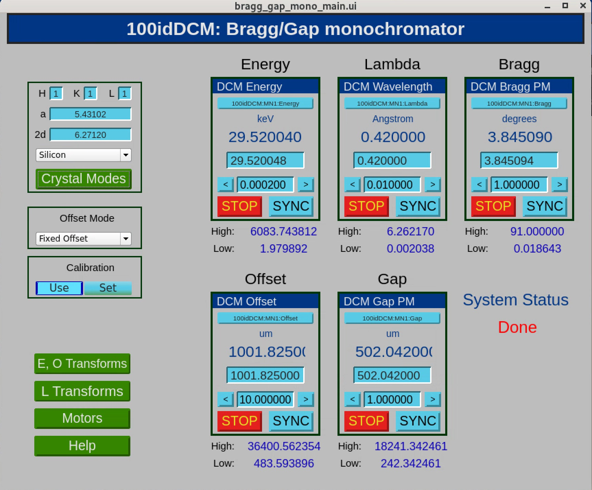

Similar to Kohzu Geometry 2 with Z-frozen. However, this design
relies on pseudomotors and database programming instead of SNL to
handle motion and limits.

The monochromator can be driven in energy, wavelength, or angle.
Undriven fields are kept consistent automatically with driven fields.

High-Resolution Double-Crystal (Theta1, Theta2)
------------------------------------------------

synApps currently supports two geometries of a high energy-resolution,
dispersive double-crystal monochromator. Both geometries actually
employ four crystals, but two of the crystals are channel-cut partners
of the other two, and therefore are not driven. Crystal angles for
these monochromators are described and controlled with three sets of
variables:

| Variable | Description |
| - | - |
| Theta*n* | Bragg angle, the angle between beam incident on a crystal and the crystal's diffracting planes |
| Phi | The angle between the crystal's diffracting planes and the horizontal. By definition here, the beam incident on the monochromator is "horizontal". Small changes in incident-beam direction can be accommodated by the "world" offset, shown in the control displays below. |
| dPhi | The difference between the actual angle, Phi, and the nominal value of this angle, Phi0. These are the motors actually driven by the software. The hardware for which this software was designed has extremely high resolution (nanoradian) rotation stages with very limited angular ranges. |

### hr\_nested.adl (nested geometry)

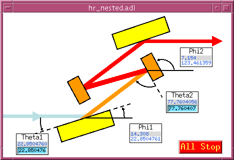

This display is a cartoon of the nested high-resolution monochromator
geometry, defining the meanings of the angles Theta and Phi.

In this diagram, the crystals are drawn as if their diffracting
planes were parallel to the crystal surface. This is not always the
case in actual practice, particularly for the first crystal of the
nested geometry, which typically is asymmetrically cut to match the
incident beam divergence to the angular range over which the second
crystal accepts a monochromatic beam. Asymmetrically cut crystals
will diffract at slightly different angles than symmetrically cut
crystals, because the entrance and exit beams will be refracted by
different amounts. The control software does not take
index-of-refraction effects into account.

### hrSeqCtl\_All.adl (nested geometry)

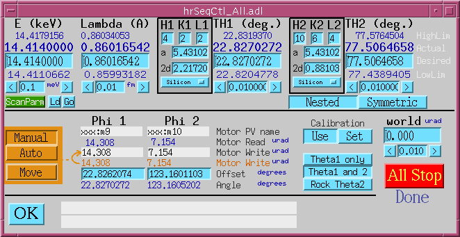

This is the full control display for a high-resolution monochromator
in the "nested" geometry. At top left are energy and wavelength drive
areas, with columns of numbers in the standard form for motors. From
the top: HighLimit, Readback, Drive, LowLimit, and Tweak. In the
middle are the crystal parameters and Bragg-angle drive area for the
first crystal, TH1 (i.e., the crystal surface that the beam hits
first, and its channel-cut pair, if any). At right are the crystal
parameters and drive area for the second crystal, TH2. The software
makes sure all these fields are consistent with each other, so you
can control the monochromator with any of them.

High and low limits of energy, wavelength, and the Bragg angles are
calculated from limits of the motors that actually drive crystals,
the Phi1 and Phi2 motors. These motors have engineering units of
microradians, and may have small angular ranges about an offset angle
that the software calculates but need not be able to read or drive.
The software simply assumes, for example, that when Phi1 is at zero,
the Phi1 crystal is oriented at the displayed offset angle.

Below the heavy black line is the connection between calculated Bragg
angles and actual crystal motions. When a change is made to any of
energy, wavelength, or Bragg angle, the software reconciles all the
other values, according to the mode ("Theta1 only"; "Theta1 and
Theta2"; "Rock Theta2") switch, and calculates the actual crystal
angles (Phi1, Phi2) required to achieve the new Bragg angles. These
new crystal angles are displayed in the bottom row of values under
the "Phi 1" and "Phi 2" headings. If the "calibration" switch is set
to "Use", new Phi-motor drive values are calculated from the Phi
values, by subtracting the offsets and converting from degrees to
microradians. If the "Calibrate" switch is set to "Set", the offsets
are calculated from the new Phi values and the existing motor
positions.

After new Phi-motor values have been calculated, they are adjusted by
the "world" offset, an arbitrary angle by which the user can allow
for small shifts in the incident beam angle.

When new, adjusted Phi-motor values have been calculated, they are
displayed in the orange "Motor Write" row under the "Phi 1" and
"Phi 2" headings. If the "Manual"/"Auto" switch is set to "Auto",
the new values will also be written to the motors. If the switch is
set to "Manual", this will happen only when the "Move" button is
pressed.

### hr\_symmetric.adl (symmetric geometry)

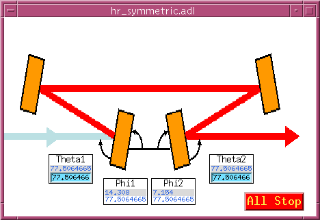

This display is a cartoon of the symmetric high-resolution
monochromator geometry, defining the meanings of the angles Theta and
Phi. Although this diagram shows two channel-cut pairs of identical
crystals, the crystals need not be identical.

### hrSeqCtl\_All.adl (symmetric geometry)

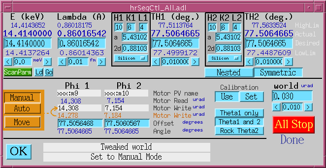

This display shows the symmetric geometry in use.

Spherical Grating (Phi, r\_entrance, r\_exit)
----------------------------------------------

| SGM.adl | SGM\_tiny.adl |
|:---:|:---:|
| 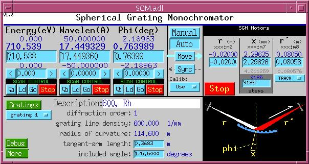 | 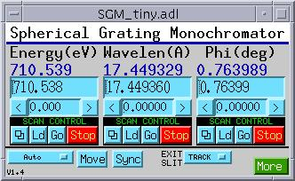 |

These are the control displays for a spherical grating monochromator.
The supported geometry comprises an input slit, a grating driven by a
tangent arm, and an exit slit. The angle between the incoming and
outgoing beams is fixed. The grating may have up to 16 stripes, whose
properties are specified in the following control display:

### SGM\_gratings.adl

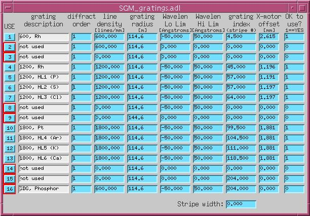

| Column | Description |
| - | - |
| Description | Anything the user wants to write |
| Diffraction order | "Grating", as used here, means a physical grating stripe and a particular diffraction order |
| Line density | Number of grating lines per mm |
| Radius of curvature | Stripes can have different radii |
| Wavelength low limit | Smallest wavelength for which this stripe should be used |
| Wavelength high limit | Largest wavelength for which this stripe should be used |
| Grating index | Position of the grating-translation motor that will put this stripe into the incoming beam |
| Grating-motor offset | Correction to be applied to the calculated tangent-arm motor while this stripe is in use |
| OK to use | If this field is zero, the user will not be permitted to select this stripe for use |

Multilayer (Theta1, Theta2, Y2, Z2)
------------------------------------

| ml\_monoGraphic.adl | ml\_monoSeqCtl.adl |
|:---:|:---:|
| 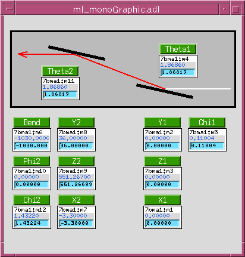 | 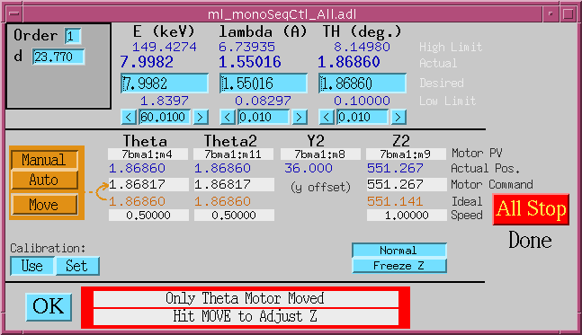 |

These are the control displays for a multilayer monochromator,
comprised of two independently supported multilayers with the same
__d__ spacing and diffraction order, in a nondispersive
configuration. Both multilayers have Theta, X, Y, Z, and Chi motors;
the downstream multilayer also has Phi and bend motors. The software
drives Theta motors to an angle calculated from the multilayer __d__
spacing and diffraction-order number, reads the Y offset as the
position of the second multilayer's Y motor, and drives the second
multilayer's Z motor so that beam diffracted from the first
multilayer intersects the second multilayer in the same spot, as the
selected beam energy is varied.
