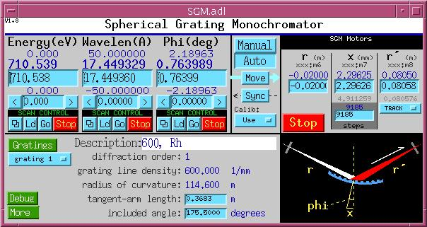
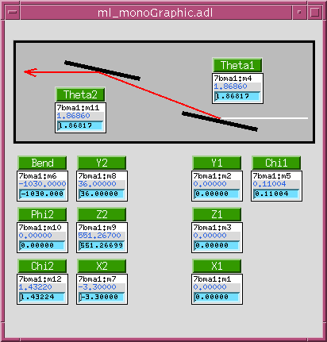
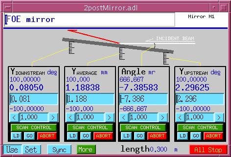
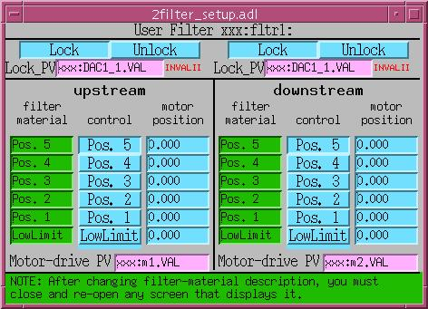
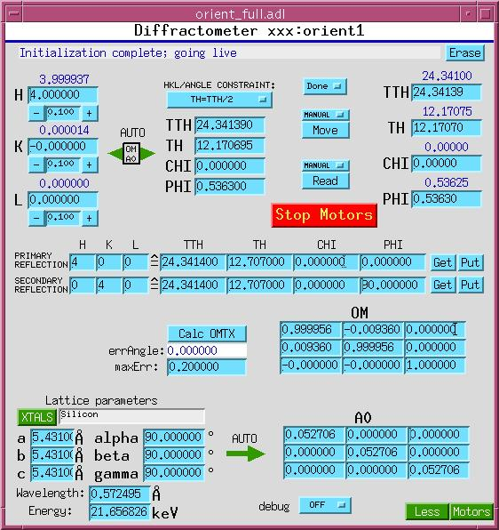

The synApps Optics module 
=========================

The optics module contains support for devices used to modify the x-ray beam from a synchrotron source and apply it in experimentally useful ways, including a variety of monochromators, slits, filters, mirrors, diffractometers, and optical tables.

### Monochromators

synApps supports the following monochromator types/geometries:

- non-dispersive double-crystal with symmetric offset -- rotates about a point midway between the entrance and exit beams.
- non-dispersive double-crystal with asymmetric offset -- rotates about a point on the first crystal's surface.
- dispersive double crystal -- nested geometry
- dispersive double crystal -- symmetric geometry
- spherical grating
- multilayer

#### Kohzu/PSL geometry 1 (Theta, Y1, Z2)

  
kohzuGraphic.adl

This MEDM display is a picture of Kohzu/PSL geometry 1, with white beam entering from the left, monochromatized radiation diffracting upward from the first crystal and then forward from the second crystal. The crystal stages are mounted on a plate which rotates about a point midway, vertically, between the incident and exiting beam.

The difference in height between the incident beam and the point about which the plate rotates is called the monochromator offset, and the software allows this offset to be changed by a knowledgeable developer, though not by the casual user. (Note that users sometimes use 'offset' to mean the vertical distance between the incident and exit beams, which is twice the offset as defined here.) The crystals normally translate, as the plate rotates, to keep the first crystal in the incident beam, and to maintain the exiting beam at constant height.

As the monochromator rotates from a Bragg angle (Theta) of zero, the first crystal moves away from the rotation point along a line normal to its diffracting planes, executing the equation

 
```
<pre style="margin-bottom: 0.2in">Y = -offset/cos(Theta).
```

  
Thus, `Y(Theta=0) = -offset`, and a positive- sense motion would move the crystal toward the rotation point.

At the same time, the second crystal moves toward the rotation point along a line which is parallel to the crystal's diffracting planes, and which intersects the rotation point, according to the equation

 
```
<pre style="margin-bottom: 0.2in">Z = offset/sin(Theta).
```

  
Thus, a positive-sense motion of the second crystal moves it in the direction of the exiting beam.

Because the Y and Z motions are nonlinear functions of Theta, their speeds ideally should vary as they move. The software doesn't attempt this, but it does attempt to set motor speeds to the closest linear approximation to ideal behavior. This means that it attempts to set motor speeds so that Theta, Y, and Z all move for the same length of time. The attempt may not succeed, however, because the motors have high and low speed limits, and will refuse commands to violate them.

- - - - - -

  
kohzuSeqCtl\_All.adl

This MEDM display serves both geometries, and contains all of the user-modifiable fields that control and set them up. Smaller, less complicated displays are also provided.

At top left, crystal parameters are selected from a list that includes Silicon (at room temperature, and at 77K), Germanium, and Diamond. Miller indices can also be specified. When fields in this section are modified, the resulting reflection is checked, and the software is put into Manual-Move mode (described below).

The monochromator can be driven in energy, wavelength, or angle. Undriven fields are kept consistent automatically with driven fields.

The software can be in Manual-Move, or Auto\_Move mode. In Manual-Move mode, changes to energy, wavelength, or theta are not sent to the motors until the user issues a "Move" command. In Auto\_Move mode, changes to energy, wavelength, or theta are sent to the motors without further prompting from the user.

The manner in which 'Y', and 'Z' motions of monochromator crystals are calculated depends on the setting of a second mode switch, with the following options:

  | Normal | - | Y,Z driven per equations described above. |
|---|---|---|
| Channel Cut | - | Y,Z are left at their current positions |
| Freeze Z | - | Z is left at its current position |
| Freeze Y | - | Y is left at its current position |

The display pictured above uses EPICS analog output records for virtual motors such as Energy, Lambda, etc. Taking Energy as an example, the PV names for drive and readback are "$(P)BraggEAO" and "$(P)BraggERdbkAO". These PV names are inconvenient for users (particularly, spec users) who would prefer to talk to soft motor records, rather than separate ao records. There is a second version of the Kohzu monochromator software that uses soft motor records for virtual motions. See kohzu\*soft\* in src, Db, and op directories.


#### Kohzu geometry 2 (Theta, Y2, Z2)

  
kohzu2Graphic.adl

This MEDM display is a picture of Kohzu/PSL geometry 2, with white beam entering from the left, monochromatized radiation diffracting upward from the first crystal and then forward from the second crystal. The crystal stages are mounted on a plate which rotates about a point on the surface on of the first crystal.

The difference in height between the entrance and exit beams is called the monochromator offset, and the software allows this offset to be changed by the user. (Note this geometry's 'offset' is different from that of the Kohzu 1 geometry.) The second crystal normally translates, as the plate monochromator rotates, to maintain the exiting beam at constant height.

As the monochromator rotates from a Bragg angle (Theta) of zero, the second crystal moves upward along a line normal to its diffracting planes, executing the equation

 
```
<pre style="margin-bottom: 0.2in">Y = -offset/(2*cos(Theta)).
```

At the same time, the second crystal moves toward the rotation point along a line which is parallel to the crystal's diffracting planes, according to the equation

 
```
<pre style="margin-bottom: 0.2in">Z = offset/(2*sin(Theta)).
```

  
Thus, a positive-sense motion of the second crystal moves it in the direction of the exiting beam.

Because the Y and Z motions are nonlinear functions of Theta, their speeds ideally should vary as they move. The software doesn't attempt this, but it does attempt to set motor speeds to the closest linear approximation to ideal behavior. This means that it attempts to set motor speeds so that Theta, Y, and Z all move for the same length of time. The attempt may not succeed, however, because the motors have high and low speed limits, and will refuse commands to violate them.


#### High-resolution double-crystal (Theta1, Theta2)

synApps currently supports two geometries of a high energy-resolution, dispersive double crystal monochromator. Both geometries actually employ four crystals, but two of the crystals are channel-cut partners of the other two, and therefore are not driven. Crystal angles for these monochromators are described and controlled with three sets of variables:

  | Thetan | - | Bragg angle, the angle between beam incident on a crystal and the crystal's diffracting planes. |
|---|---|---|
| Phi | - | The angle between the crystal's diffracting planes and the horizontal. (By definition here, the beam incident on the monochromator is "horizontal". Note that small changes in incident-beam direction can be accommodated by the "world" offset, shown in the control displays below.) |
| dPhi | - | (not shown in the diagram below) The difference between the actual angle, Phi, and the nominal value of this angle, Phi0. These are the motors actually driven by the software. The hardware for which this software was designed has extremely high resolution (nanoradian) rotation stages with very limited angular ranges. |

  
hr\_nested.adl (nested geometry)

This display is a cartoon of the nested high-resolution monochromator geometry, defining the meanings of the angles Theta and Phi.

In this diagram, the crystals are drawn as if their diffracting planes were parallel to the crystal surface. This is not always the case in actual practice, particularly for the first crystal of the nested geometry, which typically is asymmetrically cut to match the incident beam divergence to the angular range over which the second crystal accepts a monochromatic beam. Asymmetrically cut crystals will diffract at slightly different angles than symmetrically cut crystals, because the entrance and exit beams will be refracted by different amounts. The control software does not take index-of-refraction effects into account.

- - - - - -

  
hrSeqCtl\_All.adl (nested geometry)

This is the full control display for a high-resolution monochromator in the "nested" geometry. At top left are energy and wavelength drive areas, with columns of numbers in the standard form for motors. From the top: HighLimit, Readback, Drive, LowLimit, and Tweak. In the middle are the crystal parameters and Bragg-angle drive area for the first crystal, 'TH1' (i.e., the crystal surface that the beam hits first, and its channel-cut pair, if any). At right are the crystal parameters and drive area for the second crystal, 'TH2'. The software makes sure all these fields are consistent with each other, so you can control the monochromator with any of them.

High and low limits of energy, wavelength, and the Bragg angles are calculated from limits of the motors that actually drive crystals, the Phi1 and Phi2 motors. These motors have engineering units of microradians, and may have small angular ranges about an offset angle that the software calculates but needn't be able to read or drive. The software simply assumes, for example, that when Phi1 is at zero, the Phi1 crystal is oriented at the displayed offset angle.

Below the heavy black line is the connection between calculated Bragg angles and actual crystal motions. When a change is made to any of energy, wavelength, or Bragg angle, the software reconciles all the other values, according to the mode ("Theta1 only"; "Theta1 and Theta2"; "Rock Theta2") switch, and calculates the actual crystal angles (Phi1, Phi2) required to achieve the new Bragg angles. These new crystal angles are displayed in the bottom row of values under the "Phi 1" and "Phi 2" headings. If the "calibration" switch is set to "Use", new Phi-motor drive values are calculated from the Phi values, by subtracting the offsets and converting from degrees to microradians. If the "Calibrate" switch is set to "Set", the offsets are calculated from the new Phi values and the existing motor positions.

After new Phi-motor values have been calculated, they are adjusted by the "world" offset, an arbitrary angle by which the user can allow for small shifts in the incident beam angle.

When new, adjusted Phi-motor values have been calculated, they are displayed in the orange "Motor Write" row under the "Phi 1" and "Phi 2" headings. If the "Manual"/Auto" switch is set to "Auto", the new values will also be written to the motors. If the "Manual"/Auto" switch is set to "Manual", this will happen only when the "Move" button is pressed.

  
hr\_symmetric.adl (symmetric geometry)

This display is a cartoon of the symmetric high-resolution monochromator geometry, defining the meanings of the angles Theta and Phi. Although this diagram shows two channel-cut pairs of identical crystals, the crystals needn't be identical.

  
hrSeqCtl\_All.adl (symmetric geometry)

This display shows the symmetric geometry in use.


#### Spherical Grating (Phi, rentrance, rexit)

  
SGM.adl

  
SGM\_tiny.adl

These are the control displays for a spherical grating monochromator. The supported geometry comprises an input slit, a grating driven by a tangent arm, and an exit slit. The angle between the incoming and outgoing beams is fixed. The grating may have up to 16 stripes, whose properties are specified in the following control display:

  
SGM\_gratings.adl

| Description | Anything the user wants to write |
|---|---|
| Diffraction order | "Grating", as used here, means a physical grating stripe and a particular diffraction order |
| Line density | Number of gratings lines per mm. |
| Radius of curvature | stripes can have different radii |
| Wavelength low limit | Smallest wavelength for which this stripe should be used. |
| Wavelength high limit | Largest wavelength for which this stripe should be used. |
| Grating index | Position of the grating-translation motor that will put this stripe into the incoming beam. |
| Grating-motor offset | Correction to be applied to the calculated tangent-arm motor while this stripe is in use. |
| OK to use | If this field is zero, the user will not be permitted to select this stripe for use. |


#### Multilayer (Theta1, Theta2, Y2, Z2)

  
ml\_monoGraphic.adl

  
ml\_monoSeqCtl.adl.gif

These are the control displays for a multilayer monochromator, comprised of two independently supported multilayers with the same __d__ spacing and diffraction order, in a nondispersive configuration . Both multilayers have Theta, X, Y, Z, and Chi motors; the downstream multilayer also has Phi and bend motors. The software drives Theta motors to an angle calculated from the multilayer __d__ spacing and diffraction-order number, reads the Y offset as the position of the second multilayer's Y motor, and drives the second multilayer's Z motor so that beam diffracted from the first multilayer intersects the second multilayer in the same spot, as the selected beam energy is varied.


### Slits

  
2slit.adl

The display pictured above uses EPICS analog output records for virtual motors "-", "+", "size", and "center". Taking "size" as an example, the PV names for drive and readback are "$(P)$(SLIT)xn" and "$(P)$(SLIT)t2.B". These PV names are inconvenient for users (particularly, spec users) who would prefer to talk to soft motor records, rather than separate ao records. There is a second version of the 2slit software that uses soft motor records for virtual motions. See 2slit\*soft\* in src, Db, and op directories.

  
4slitGraphic.adl

  
xia\_slit\_full.adl


### Mirrors

  
2postMirror.adl


### Filters

  
2filter.adl

  
2filter\_setup.adl


XIA PF4 dual filter

This software treats two XIA (X-Ray Instrumentation Associates) PF4 four-filter units as separate devices, though it does calculate the total transmission of the two units. Originally, this software supported only three filter-material choices, but support for 22 elemental filter materials was grafted on later. This software drives the filter via digital I/O PVs. It also also monitors those PVs, and behaves correctly when they are changed by some external agent.

This software calculates the x-ray transmission for each combination of filters in one unit, given the current x-ray beam energy, and permits either direct setting of the desired transmission, or selection of the next higher, or next lower, transmission.


To load an instance of this support, add the following lines to the ioc startup file, `st.cmd`, before the call to `iocInit()`:


```

### Load database records for dual PF4 filters
dbLoadRecords("$(OPTICS)/opticsApp/Db/pf4common.db","P=xxx:,H=pf4:,A=A,B=B")
dbLoadRecords("$(OPTICS)/opticsApp/Db/pf4bank.db","P=xxx:,H=pf4:,B=A")
dbLoadRecords("$(OPTICS)/opticsApp/Db/pf4bank.db","P=xxx:,H=pf4:,B=B")
```

and add the following lines after the call to `iocInit()`:


```

# Start PF4 filter sequence program
#        name = what user will call it
#        P    = prefix of database and sequencer
#        H    = hardware (i.e. pf4)
#        B    = bank indicator (i.e. A,B)
#        M    = Monochromatic-beam energy PV
#        BP   = Filter control bit PV prefix
#        B1   = Filter control bit 0 number
#        B2   = Filter control bit 1 number
#        B3   = Filter control bit 2 number
#        B4   = Fitler control bit 3 number
seq &pf4,"name=pf1,P=xxx:,H=pf4:,B=A,M=xxx:BraggEAO,BP=xxx:Unidig1Bo,B1=3,B2=4,B3=5,B4=6"
seq &pf4,"name=pf2,P=xxx:,H=pf4:,B=B,M=xxx:BraggEAO,BP=xxx:Unidig1Bo,B1=7,B2=8,B3=9,B4=10"
```

For autosave suppport, add the following lines to `auto_settings.req`:


```

## PF4 dual filter
file pf4common.req P=$(P),H=pf4:
file pf4bank.req   P=$(P),H=pf4:,B=A
file pf4bank.req   P=$(P),H=pf4:,B=B
```


XIA PF4 multiple filter

This software treats two or four XIA (X-Ray Instrumentation Associates) PF4 four-filter units as a single device. It drives the filters via digital I/O PVs. It also also monitors those PVs, and behaves correctly when they are changed by some external agent.

This software calculates the x-ray transmission for all combinations of all filters in all units, given the current x-ray beam energy. It permits direct setting of the desired transmission, setting the transmission relative to the current value (e.g., down by 10%, up by a factor of 2, etc.), and selection of the next higher, or next lower, transmission. It also permits individual filters to be removed from consideration, and locked in or out of the x-ray beam.


To Load an instance of this support, add the following lines to the ioc startup file, st.cmd, before the call to iocInit(): ```

### Load database records for alternative PF4-filter support
dbLoadTemplate "filter.substitutions"
```

and add the following lines after the call to iocInit(): ```

# Alternative pf4 filter seq program
seq filterDrive,"NAME=filterDrive,P=xxx:,R=filter:,NUM_FILTERS=16"
```

Here's a sample filter.substitutions file: ```

# filter.substitutions

file "$(OPTICS)/opticsApp/Db/filterBladeNoSensor.db" {
  pattern
  {P,           R,        N,   DESC,           OUT}
  {xxx:,   filter:,  1,   "Filter 1",     "xxx:Unidig1Bo0"}
  {xxx:,   filter:,  2,   "Filter 2",     "xxx:Unidig1Bo1"}
  {xxx:,   filter:,  3,   "Filter 3",     "xxx:Unidig1Bo2"}
  {xxx:,   filter:,  4,   "Filter 4",     "xxx:Unidig1Bo3"}
  {xxx:,   filter:,  5,   "Filter 5",     "xxx:Unidig1Bo4"}
  {xxx:,   filter:,  6,   "Filter 6",     "xxx:Unidig1Bo5"}
  {xxx:,   filter:,  7,   "Filter 7",     "xxx:Unidig1Bo6"}
  {xxx:,   filter:,  8,   "Filter 8",     "xxx:Unidig1Bo7"}
  {xxx:,   filter:,  9,   "Filter 9",     "xxx:Unidig1Bo8"}
  {xxx:,   filter:,  10,  "Filter 10",    "xxx:Unidig1Bo9"}
  {xxx:,   filter:,  11,  "Filter 11",    "xxx:Unidig1Bo10"}
  {xxx:,   filter:,  12,  "Filter 12",    "xxx:Unidig1Bo11"}
  {xxx:,   filter:,  13,  "Filter 13",    "xxx:Unidig1Bo12"}
  {xxx:,   filter:,  14,  "Filter 14",    "xxx:Unidig1Bo13"}
  {xxx:,   filter:,  15,  "Filter 15",    "xxx:Unidig1Bo14"}
  {xxx:,   filter:,  16,  "Filter 16",    "xxx:Unidig1Bo15"}
}

file "$(OPTICS)/opticsApp/Db/filterDrive.db" {
  {P="xxx:", R="filter:", DESC="Filters", KEV="xxx:BraggEAO"}
}
```

and here are lines added to auto\_settings.req for these filters: ```

file filterDrive.req "P=xxx:,R=filter:"
file filterBladeNoSensor.req "P=xxx:,R=filter:,N=1"
file filterBladeNoSensor.req "P=xxx:,R=filter:,N=2"
file filterBladeNoSensor.req "P=xxx:,R=filter:,N=3"
file filterBladeNoSensor.req "P=xxx:,R=filter:,N=4"
file filterBladeNoSensor.req "P=xxx:,R=filter:,N=5"
file filterBladeNoSensor.req "P=xxx:,R=filter:,N=6"
file filterBladeNoSensor.req "P=xxx:,R=filter:,N=7"
file filterBladeNoSensor.req "P=xxx:,R=filter:,N=8"
file filterBladeNoSensor.req "P=xxx:,R=filter:,N=9"
file filterBladeNoSensor.req "P=xxx:,R=filter:,N=10"
file filterBladeNoSensor.req "P=xxx:,R=filter:,N=11"
file filterBladeNoSensor.req "P=xxx:,R=filter:,N=12"
file filterBladeNoSensor.req "P=xxx:,R=filter:,N=13"
file filterBladeNoSensor.req "P=xxx:,R=filter:,N=14"
file filterBladeNoSensor.req "P=xxx:,R=filter:,N=15"
file filterBladeNoSensor.req "P=xxx:,R=filter:,N=16"

```

Top level MEDM display files for this support are filter\_8\_0\_more.adl for two PF4 4-filter units filter\_8\_8\_more.adl for four PF4 4-filter units To load the MEDM display file, specify a related display button with something like the following entries: ```

Display Label: PF4 filter 16
Display File: filter_8_8_more.adl
Arguments: P=xxx:,R=filter
```


### Optical table

The optical-table software is documented separately. See [tableRecord.html](tableRecord.html)

Note that there are two versions of the optical table software. The original version uses EPICS analog output records for virtual motors. This is inconvenient for users (particularly, spec users) who would prefer to talk to soft motor records, rather than separate ao records. There is a new version of the optical table software software that uses soft motor records for virtual motions. See table\*soft\* in src, Db, and op directories.


### Orientation matrix (diffractometer control)

  
orient\_full.adl

  
orient\_XTALS.adl


### Io calculation (Jon Tischler)

  
Io.adl

  
Io\_small.adl

This software calculates the photon flux through an ion chamber, given the counts recorded in scaler channels, and data describing the ionization chamber, the beam energy, and the signal path from ionization chamber to scaler.


### PID loop support

  
fb\_epid.adl

The fb\_epid support provides a database centered around the EPICS [epid](http://cars9.uchicago.edu/software/epics/epidRecord.html) record. [Documentation](fb_epid/index.html) is provided on a separate page.


Suggestions and Comments to:   
[Tim Mooney ](mailto:mooney@aps.anl.gov): (mooney@aps.anl.gov)
