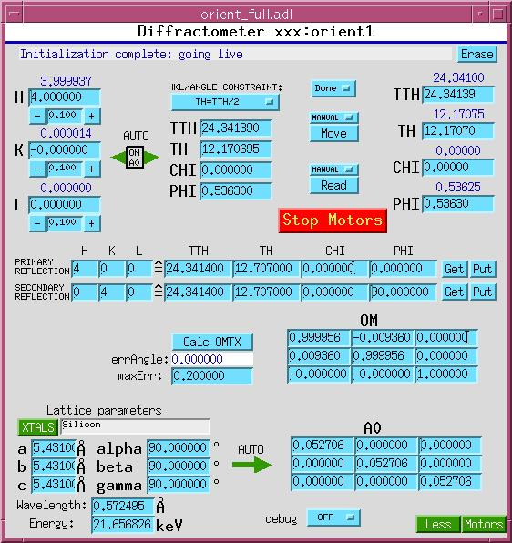
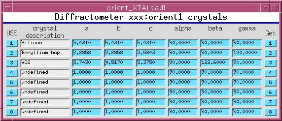
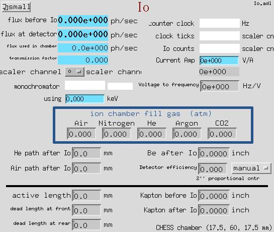
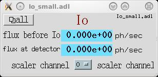

# Other Devices
{: .no_toc}

## Table of contents
{: .no_toc .text-delta }

- TOC
{:toc}

Optical Table
-------------

The optical table software controls six (or fewer) motors that drive
a platform with full 6-DOF motion (X, Y, Z translations and AX, AY,
AZ rotations). Four table geometries are supported: SRI, PNC,
GEOCARS, and NEWPORT.

The optical table is implemented as a custom EPICS record type. See
the [Table Record](tableRecord.html) reference for complete
documentation of fields, geometries, and setup instructions.

{: .note }
> There are two versions of the optical table software. The original
> version uses EPICS analog output records for virtual motors. A
> newer version uses soft motor records for virtual motions, which
> is more convenient for spec users. See `table*soft*` in `src`,
> `Db`, and `op` directories.

Orientation Matrix (Diffractometer Control)
-------------------------------------------

| orient\_full.adl | orient\_XTALS.adl |
|:---:|:---:|
|  |  |

The orientation matrix support provides 4-circle diffractometer
control. It uses an orientation matrix to convert between reciprocal
space coordinates (HKL) and diffractometer angles. The support
includes an SNL program (`orient_st.st`) and C library code
(`orient.c`, `matrix3.c`) for the matrix calculations.

Io Calculation
--------------

| Io.adl | Io\_small.adl |
|:---:|:---:|
|  |  |

This software (by Jon Tischler) calculates the photon flux through
an ion chamber, given the counts recorded in scaler channels, and
data describing the ionization chamber, the beam energy, and the
signal path from ionization chamber to scaler.

PID Feedback
------------

The `fb_epid` support provides a database centered around the EPICS
epid record for generic, user-reconfigurable software feedback.

See the [EPID Feedback](fb_epid/index.html) documentation for
complete details on installation, configuration, tuning, and
examples.
