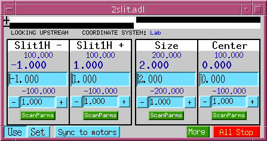
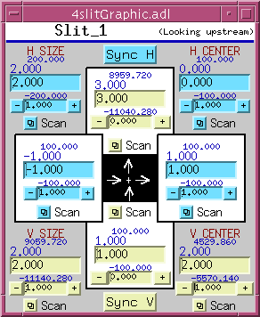
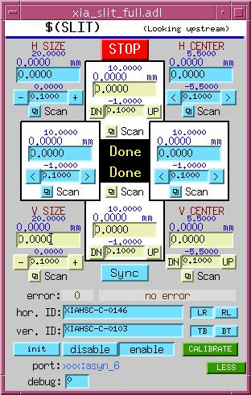

# Slits
{: .no_toc}

## Table of contents
{: .no_toc .text-delta }

- TOC
{:toc}

2-Blade Slits
-------------

### 2slit.adl

The 2-blade slit database (`2slit.db`) provides coordinated control
of two slit blades through four virtual motors: "-", "+", "size", and
"center".

{: .note }
> The display pictured above uses EPICS analog output records for
> virtual motors. There is a second version of the 2-blade slit
> software that uses soft motor records for virtual motions, which
> is more convenient for spec users. See `2slit*soft*` in `src`,
> `Db`, and `op` directories.

### RELTOCENTER macro

The `2slit.db` database can operate in two modes, controlled by the
`RELTOCENTER` macro:

| Value | Description |
| - | - |
| `RELTOCENTER=0` (default) | Both motors are in the same coordinate system. When the center position is increased, both motors' `.VAL` fields increase. Both motors must have the same engineering units. |
| `RELTOCENTER=1` | Motor `.VAL` fields increase as the slit opens. Both motors must have the same engineering units. |

### Calibration and synchronization

The slit software keeps all readback values current regardless of how
the actual motors are moved or recalibrated, but it does not
automatically reset the slit drive values when the underlying motors
are moved directly. To synchronize, use the "SYNC" button on the
display, which reads the actual motor drive values and sets the slit
drive values accordingly.

To recalibrate slit positions, press "Set", type in the desired
current position, and press "Use". This uses the "Set" buttons and
user/dial offsets of both underlying motors.

4-Blade and XIA Slits
----------------------

| 4slitGraphic.adl | xia\_slit\_full.adl |
|:---:|:---:|
|  |  |

The 4-blade slit graphic display provides a visual overview of all
four blades with size and center readbacks. The XIA HSC slit support
communicates with XIA hardware via an SNL program (`xia_slit.st`)
and provides coordinated size and center control.
