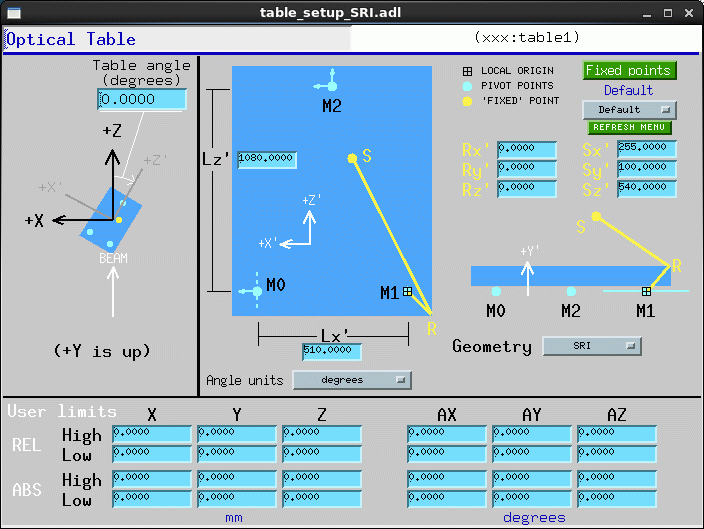
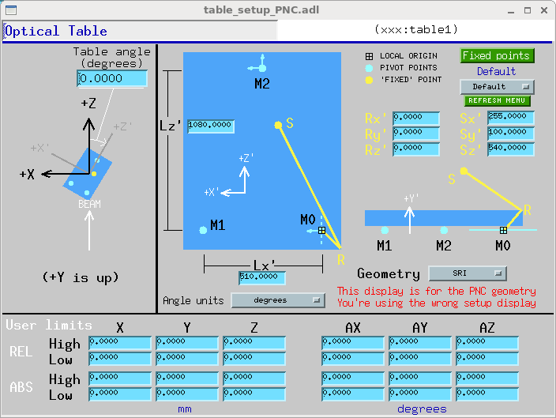
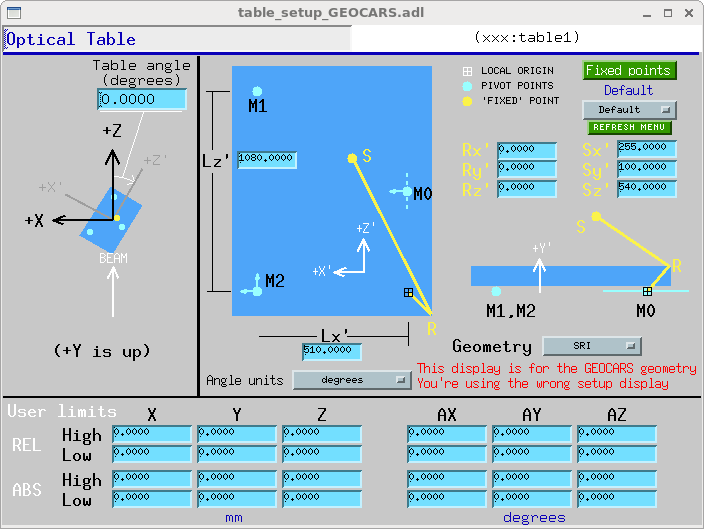
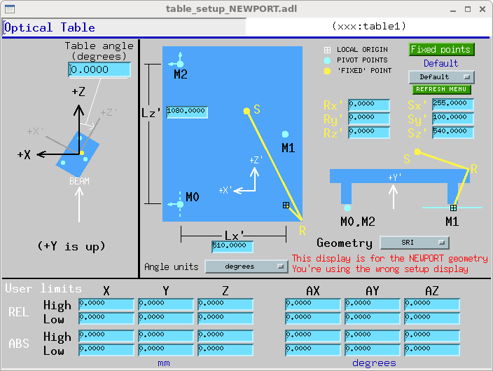

Table Record and related software
=================================

Tim Mooney  
- - - - - -

Contents
--------

- [Overview](#Overview)
- [Differences from previous versions](#Differences)
- [Field Descriptions](#Fields)
- [Files](#Files)
- [Restrictions](#Restrictions)

<a name="Overview"></a>Overview
--------

This documentation describes version 5.14 of the EPICS table record, and related EPICS software recommended for building and using it. This version of the record is compatible with EPICS Release 3.14.X, and it is not compatible with any earlier releases of EPICS. The table record controls six (or fewer) motors that drive an optical table, a platform that generally can move in three orthogonal directions (X, Y, and Z), and rotate about the X, Y, and Z axes by angles AX, AY, and AZ. The record allows users to specify the point about which rotations are to occur--this is called the "fixed point" in the figures below.

The record assumes the platform rests on three pivot points named M0, M1, and M2. (See Figs. 1-4, below). The locations of these pivot points, and the manner in which they move, is specified by the field GEOM (loosely, the table geometry). Four geometries, named SRI, PNC, GEOCARS, and NEWPORT, are supported by this version of the table record.

  
Figure 1 (SRI geometry)

  
Figure 2 (PNC geometry)

  
Figure 3 (GEOCARS geometry)

  
Figure 4 (NEWPORT geometry)

  
In the SRI, PNC, and GEOCARS geometries, three motors (M0Y, M1Y, M2Y) move M0, M1, and M2 in the Y direction (vertically); one motor (M0X) moves M0 in the X direction; one motor (M2X) moves M2 in the X direction; and one motor (M2Z) moves M2 in the Z direction. M1 is unconstrained in the X-Z plane; M0 is unconstrained along the Z axis.

In the NEWPORT geometry, the three motors (M0Y, M1Y, M2Y) vary the lengths of the table legs (i.e., the distances between the table top and pivot points M0, M1, and M2). Thus, in this geometry the pivot points do not move vertically.

You are (or the instrument specialist is) expected to customize the table software by specifying the motors it is to control, and to set up the table by describing the locations of the pivot points, and by specifying the table geometry, the orientation angle of the table with respect to the laboratory coordinate system, the location of the point about which the table is to rotate (also called the "fixed" point in this documentation), and any absolute user limits on virtual motors.

<a name="Differences"></a>

Differences from previous versions
----------------------------------

- Previously, the transformation between user coordinates (the translations X, Y, Z; the angles AX, AY, AZ; and limits constraining those quantities) and motor coordinates (M0X, M0Y, M1Y, M2X, M2Y, M2Z, and associated limits) was calculated only to first order in the angles. In this version, all calculations are exact.
- Previously, the location of the point fixed under rotations was specified by the fields SX, SY, and SZ, which were distances from various pivot points with various sign conventions. In this version, the location is specified by two vectors: a reference-point vector R, which locates an arbitrary point from which measurements are practical (e.g., a corner of the table surface); and the vector, S, which locates the fixed point relative to R. These vectors are specified with the fields RX, RY, RZ, SX, SY, SZ. They are defined relative to the origin of the table's local coordinate system. (See Figs. 1-4.)
    
    If R=0, the new system is nearly identical to the old, except for the value SX, whose definition has changed such that SX\_new = LX - SX\_old. (In most cases, SX\_old was equal to LX/2, so no change is required.)
- The field LX21 has been deleted.

<a name="Fields"></a>

Field Descriptions
------------------

In addition to fields common to all record types (see the [EPICS Record Reference Manual](http://www.aps.anl.gov/asd/controls/epics/EpicsDocumentation/AppDevManuals/RecordRef/Recordref-1.html) for these) the table record has the fields described below. 

| [Alphabetical listing of all fields](#Fields_alphabetical) | with *terse* descriptions |
|---|---|
| [Calibration fields](#Fields_calib) | allow you to redefine the table position |
| [Setup fields](#Fields_setup) | specify the table dimensions and the location of the "fixed point" |
| [Link fields](#Fields_link) | connect the table record to motor records |
| [Limit fields](#Fields_limit) | values read from or calculated from motor limits |
| [Speed fields](#Fields_speed) | attempt to keep the "fixed" point fixed even while moving |
| [Table drive fields](#Fields_tblDrv) | by which you move the table |
| [Motor drive fields](#Fields_motDrv) | by which the table record moves motors |
| [Readback fields](#Fields_readback) | current and desired positions of table and motors |
| [Miscellaneous fields](#Fields_misc) | engineering units, command "buttons", etc. |
| [Private fields](#Fields_prvt) | in which you are not expected to be interested |

- - - - - -

| Name | Access | Prompt | Data type | Comment |
|---|---|---|---|------------|
| [A](#Fields_prvt) | R | x to m matrix | DOUBLE\* | 3x3 rotation matrix |
| [AEGU](#Fields_misc) | R/W | Angular Units Name | MENU | Engineering units for angles (16-chars). This field will be filled in by the record according to AUNIT |
| [AUNIT](#Fields_misc) | R/W | Angular Units Menu | STRING | Engineering units for angles: "degrees" or microradians ("ur") |
| [AX0](#Fields_calib) | R/W | x-angle offset | DOUBLE | True table position - reported table position |
| [AX](#Fields_tblDrv) | R/W\* | x angle | DOUBLE | x-angle drive field |
| [AXL](#Fields_calib) | R | x angle true value | DOUBLE | True x angle |
| [AXRB](#Fields_readback) | R | x angle readback | DOUBLE | x angle calculated from motor drive values |
| [AY0](#Fields_calib) | R/W | y-angle offset | DOUBLE | True table position - reported table position |
| [AY](#Fields_tblDrv) | R/W\* | y angle | DOUBLE | y-angle drive field |
| [AYL](#Fields_calib) | R | y angle true value | DOUBLE | True y angle |
| [AYRB](#Fields_readback) | R | y angle readback | DOUBLE | y angle calculated from motor drive values |
| [AZ0](#Fields_calib) | R/W | z-angle offset | DOUBLE | True table position - reported table position |
| [AZ](#Fields_tblDrv) | R/W\* | z angle | DOUBLE | z-angle drive field |
| [AZL](#Fields_calib) | R | z angle true value | DOUBLE | True z angle |
| [AZRB](#Fields_readback) | R | z angle readback | DOUBLE | z angle calculated from motor drive values |
| [B](#Fields_prvt) | R | m to x matrix | DOUBLE\* | 3x3 utility matrix |
| [E0X](#Fields_readback) | R | encoder 0X val | DOUBLE | Current position of M0X motor |
| [E0XI](#Fields_link) | R/W | encoder 0X inlink | INLINK | Link from M0X motor's readback |
| [E0Y](#Fields_readback) | R | encoder 0Y val | DOUBLE | Current position of M0Y motor |
| [E0YI](#Fields_link) | R/W | encoder 0Y inlink | INLINK | Link from M0Y motor's readback |
| [E1Y](#Fields_readback) | R | encoder 1Y val | DOUBLE | Current position of M1Y motor |
| [E1YI](#Fields_link) | R/W | encoder 1Y inlink | INLINK | Link from M1Y motor's readback |
| [E2X](#Fields_readback) | R | encoder 2X val | DOUBLE | Current position of M2X motor |
| [E2XI](#Fields_link) | R/W | encoder 2X inlink | INLINK | Link from M2X motor's readback |
| [E2Y](#Fields_readback) | R | encoder 2Y val | DOUBLE | Current position of M2Y motor |
| [E2YI](#Fields_link) | R/W | encoder 2Y inlink | INLINK | Link from M2Y motor's readback |
| [E2Z](#Fields_readback) | R | encoder 2Z val | DOUBLE | Current position of M2Z motor |
| [E2ZI](#Fields_link) | R/W | encoder 2Z inlink | INLINK | Link from M2Z motor's readback |
| [EAX](#Fields_readback) | R | encoder x angle | DOUBLE | Current table position (x angle) |
| [EAY](#Fields_readback) | R | encoder y angle | DOUBLE | Current table position (y angle) |
| [EAZ](#Fields_readback) | R | encoder z angle | DOUBLE | Current table position (z angle) |
| [EX](#Fields_readback) | R | encoder x | DOUBLE | Current table position (x translation) |
| [EY](#Fields_readback) | R | encoder y | DOUBLE | Current table position (y translation) |
| [EZ](#Fields_readback) | R | encoder z | DOUBLE | Current table position (z translation) |
| [H0X](#Fields_limit) | R | motor 0X hi limit | DOUBLE |  |
| [H0XL](#Fields_link) | R/W | motor 0X HLM link | INLINK | Link from motor's limit field |
| [H0Y](#Fields_limit) | R | motor 0Y hi limit | DOUBLE |  |
| [H0YL](#Fields_link) | R/W | motor 0Y HLM link | INLINK | Link from motor's limit field |
| [H1Y](#Fields_limit) | R | motor 1Y hi limit | DOUBLE |  |
| [H1YL](#Fields_link) | R/W | motor 1Y HLM link | INLINK | Link from motor's limit field |
| [H2X](#Fields_limit) | R | motor 2X hi limit | DOUBLE |  |
| [H2XL](#Fields_link) | R/W | motor 2X HLM link | INLINK | Link from motor's limit field |
| [H2Y](#Fields_limit) | R | motor 2Y hi limit | DOUBLE |  |
| [H2YL](#Fields_link) | R/W | motor 2Y HLM link | INLINK | Link from motor's limit field |
| [H2Z](#Fields_limit) | R | motor 2Z hi limit | DOUBLE |  |
| [H2ZL](#Fields_link) | R/W | motor 2Z HLM link | INLINK | Link from motor's limit field |
| [HLAX](#Fields_limit) | R | x angle hi limit | DOUBLE | Calculated from motor limits |
| [HLAY](#Fields_limit) | R | y angle hi limit | DOUBLE | Calculated from motor limits |
| [HLAZ](#Fields_limit) | R | z angle hi limit | DOUBLE | Calculated from motor limits |
| [HLX](#Fields_limit) | R | x hi limit | DOUBLE | Calculated from motor limits |
| [HLY](#Fields_limit) | R | y hi limit | DOUBLE | Calculated from motor limits |
| [HLZ](#Fields_limit) | R | z hi limit | DOUBLE | Calculated from motor limits |
| [INIT](#Fields_misc) | R/W\* | init table | SHORT | Command: Abandon calibration and sync drive fields to motor positions |
| [GEOM](#Fields_setup) | R/W\* | table geometry | DOUBLE | (0:"SRI", 1:"GEOCARS", 2:"NEWPORT", 3:"PNC") Specify the arrangement of table legs and motors. |
| [L0X](#Fields_limit) | R | motor 0X lo limit | DOUBLE |  |
| [L0XL](#Fields_link) | R/W | motor 0X LLM link | INLINK | Link from motor's limit field |
| [L0Y](#Fields_limit) | R | motor 0Y lo limit | DOUBLE |  |
| [L0YL](#Fields_link) | R/W | motor 0Y LLM link | INLINK | Link from motor's limit field |
| [L1Y](#Fields_limit) | R | motor 1Y lo limit | DOUBLE |  |
| [L1YL](#Fields_link) | R/W | motor 1Y LLM link | INLINK | Link from motor's limit field |
| [L2X](#Fields_limit) | R | motor 2X lo limit | DOUBLE |  |
| [L2XL](#Fields_link) | R/W | motor 2X LLM link | INLINK | Link from motor's limit field |
| [L2Y](#Fields_limit) | R | motor 2Y lo limit | DOUBLE |  |
| [L2YL](#Fields_link) | R/W | motor 2Y LLM link | INLINK | Link from motor's limit field |
| [L2Z](#Fields_limit) | R | motor 2Z lo limit | DOUBLE |  |
| [L2ZL](#Fields_link) | R/W | motor 2Z LLM link | INLINK | Link from motor's limit field |
| [LEGU](#Fields_misc) | R/W | Linear Units Name | STRING | Engineering units for translations (16-chars) |
| [LLAX](#Fields_limit) | R | x angle lo limit | DOUBLE | Calculated from motor limits |
| [LLAY](#Fields_limit) | R | y angle lo limit | DOUBLE | Calculated from motor limits |
| [LLAZ](#Fields_limit) | R | z angle lo limit | DOUBLE | Calculated from motor limits |
| [LLX](#Fields_limit) | R | x lo limit | DOUBLE | Calculated from motor limits |
| [LLY](#Fields_limit) | R | y lo limit | DOUBLE | Calculated from motor limits |
| [LLZ](#Fields_limit) | R | z lo limit | DOUBLE | Calculated from motor limits |
| [LVIO](#Fields_limit) | R | limit violation | SHORT | If nonzero, requested motion would violate limits |
| [LX](#Fields_setup) | R/W | wheelbase x | DOUBLE | x distance between table legs M0 and M1 |
| [LZ](#Fields_setup) | R/W | wheelbase z | DOUBLE | z distance between table legs M0 and M2 |
| [M0X](#Fields_motDrv) | R | motor 0X val | DOUBLE | Desired motor position |
| [M0XL](#Fields_link) | R/W | motor 0X outlink | OUTLINK | Link to motor's drive field |
| [M0Y](#Fields_motDrv) | R | motor 0Y val | DOUBLE | Desired motor position |
| [M0YL](#Fields_link) | R/W | motor 0Y outlink | OUTLINK | Link to motor's drive field |
| [M1Y](#Fields_motDrv) | R | motor 1Y val | DOUBLE | Desired motor position |
| [M1YL](#Fields_link) | R/W | motor 1Y outlink | OUTLINK | Link to motor's drive field |
| [M2X](#Fields_motDrv) | R | motor 2X val | DOUBLE | Desired motor position |
| [M2XL](#Fields_link) | R/W | motor 2X outlink | OUTLINK | Link to motor's drive field |
| [M2Y](#Fields_motDrv) | R | motor 2Y val | DOUBLE | Desired motor position |
| [M2YL](#Fields_link) | R/W | motor 2Y outlink | OUTLINK | Link to motor's drive field |
| [M2Z](#Fields_motDrv) | R | motor 2Z val | DOUBLE | Desired motor position |
| [M2ZL](#Fields_link) | R/W | motor 2Z outlink | OUTLINK | Link to motor's drive field |
| [MMAP](#Fields_prvt) | R | Monitor Mask | ULONG |  |
| [PP0](#Fields_prvt) | R | pivot pt 0 | DOUBLE | Desired loc of pivot point 0 (3 vector) |
| [PP1](#Fields_prvt) | R | pivot pt 1 | DOUBLE | Desired loc of pivot point 1 (3 vector) |
| [PP2](#Fields_prvt) | R | pivot pt 2 | DOUBLE | Desired loc of pivot point 2 (3 vector) |
| [PPO0](#Fields_prvt) | R | pivot pt 0 orig | DOUBLE | Current loc of pivot point 0 (3 vector) |
| [PPO1](#Fields_prvt) | R | pivot pt 1 orig | DOUBLE | Current loc of pivot point 1 (3 vector) |
| [PPO2](#Fields_prvt) | R | pivot pt 2 orig | DOUBLE | Current loc of pivot point 2 (3 vector) |
| [PREC](#Fields_misc) | R/W | Display Precision | SHORT | Number of digits to right of decimal point |
| [R0X](#Fields_readback) | R | motor 0X readback | DOUBLE | Motor's desired value |
| [R0XI](#Fields_link) | R/W | motor 0X RBV link | INLINK | Link from motor's drive field |
| [R0Y](#Fields_readback) | R | motor 0Y readback | DOUBLE | Motor's desired value |
| [R0YI](#Fields_link) | R/W | motor 0Y RBV link | INLINK | Link from motor's drive field |
| [R1Y](#Fields_readback) | R | motor 1Y readback | DOUBLE | Motor's desired value |
| [R1YI](#Fields_link) | R/W | motor 1Y RBV link | INLINK | Link from motor's drive field |
| [R2X](#Fields_readback) | R | motor 2X readback | DOUBLE | Motor's desired value |
| [R2XI](#Fields_link) | R/W | motor 2X RBV link | INLINK | Link from motor's drive field |
| [R2Y](#Fields_readback) | R | motor 2Y readback | DOUBLE | Motor's desired value |
| [R2YI](#Fields_link) | R/W | motor 2Y RBV link | INLINK | Link from motor's drive field |
| [R2Z](#Fields_readback) | R | motor 2Z readback | DOUBLE | Motor's desired value |
| [R2ZI](#Fields_link) | R/W | motor 2Z RBV link | INLINK | Link from motor's drive field |
| [READ](#Fields_misc) | R/W\* | readback motors | SHORT | Command: read current motor positions, translate to table positions |
| [RX](#Fields_setup) | R/W\* | x of ref point | DOUBLE | X position of reference point |
| [RY](#Fields_setup) | R/W\* | y of ref point | DOUBLE | Y position of reference point |
| [RZ](#Fields_setup) | R/W\* | z of ref point | DOUBLE | Z position of reference point |
| [SET](#Fields_calib) | R/W | set table | MENU | (0:"Use", 1:"Set") |
| [SSET](#Fields_calib) | R/W | Set SET Mode | SHORT | asl(ASL0) |
| [SUSE](#Fields_calib) | R/W | Set USE Mode | SHORT | asl(ASL0) |
| [SX](#Fields_setup) | R/W\* | x of fixed point | DOUBLE | X position of fixed point |
| [SY](#Fields_setup) | R/W\* | y of fixed point | DOUBLE | Y position of fixed point |
| [SYNC](#Fields_misc) | R/W\* | sync with motors | SHORT | Command: read motor positions, reconcile table positions to them |
| [SZ](#Fields_setup) | R/W\* | z of fixed point | DOUBLE | Z position of fixed point |
| [UHAX](#Fields_limit) | R/W\* | user's x angle hi limit | DOUBLE | Absolute user limit (independent of table calibration) |
| [UHAY](#Fields_limit) | R/W\* | user's y angle hi limit | DOUBLE | Absolute user limit (independent of table calibration) |
| [UHAZ](#Fields_limit) | R/W\* | user's z angle hi limit | DOUBLE | Absolute user limit (independent of table calibration) |
| [UHX](#Fields_limit) | R/W\* | user's x hi limit | DOUBLE | Absolute user limit (independent of table calibration) |
| [UHY](#Fields_limit) | R/W\* | user's y hi limit | DOUBLE | Absolute user limit (independent of table calibration) |
| [UHZ](#Fields_limit) | R/W\* | user's z hi limit | DOUBLE | Absolute user limit (independent of table calibration) |
| [ULAX](#Fields_limit) | R/W\* | user's x angle lo limit | DOUBLE | Absolute user limit (independent of table calibration) |
| [ULAY](#Fields_limit) | R/W\* | user's y angle lo limit | DOUBLE | Absolute user limit (independent of table calibration) |
| [ULAZ](#Fields_limit) | R/W\* | user's z angle lo limit | DOUBLE | Absolute user limit (independent of table calibration) |
| [ULX](#Fields_limit) | R/W\* | user's x lo limit | DOUBLE | Absolute user limit (independent of table calibration) |
| [ULY](#Fields_limit) | R/W\* | user's y lo limit | DOUBLE | Absolute user limit (independent of table calibration) |
| [ULZ](#Fields_limit) | R/W\* | user's z lo limit | DOUBLE | Absolute user limit (independent of table calibration) |
| [UHAXR](#Fields_limit) | R/W\* | user's x angle hi limit | DOUBLE | Relative user limit (varies with table calibration) |
| [UHAYR](#Fields_limit) | R/W\* | user's y angle hi limit | DOUBLE | Relative user limit (varies with table calibration) |
| [UHAZR](#Fields_limit) | R/W\* | user's z angle hi limit | DOUBLE | Relative user limit (varies with table calibration) |
| [UHXR](#Fields_limit) | R/W\* | user's x hi limit | DOUBLE | Relative user limit (varies with table calibration) |
| [UHYR](#Fields_limit) | R/W\* | user's y hi limit | DOUBLE | Relative user limit (varies with table calibration) |
| [UHZR](#Fields_limit) | R/W\* | user's z hi limit | DOUBLE | Relative user limit (varies with table calibration) |
| [ULAXR](#Fields_limit) | R/W\* | user's x angle lo limit | DOUBLE | Relative user limit (varies with table calibration) |
| [ULAYR](#Fields_limit) | R/W\* | user's y angle lo limit | DOUBLE | Relative user limit (varies with table calibration) |
| [ULAZR](#Fields_limit) | R/W\* | user's z angle lo limit | DOUBLE | Relative user limit (varies with table calibration) |
| [ULXR](#Fields_limit) | R/W\* | user's x lo limit | DOUBLE | Relative user limit (varies with table calibration) |
| [ULYR](#Fields_limit) | R/W\* | user's y lo limit | DOUBLE | Relative user limit (varies with table calibration) |
| [ULZR](#Fields_limit) | R/W\* | user's z lo limit | DOUBLE | Relative user limit (varies with table calibration) |
| [V0X](#Fields_speed) | R | speed 0X val | DOUBLE | Speed to be written to motor (for duration of commanded move) |
| [V0XI](#Fields_link) | R/W | speed 0X inlink | INLINK | Link from motor's speed field |
| [V0XL](#Fields_link) | R/W | speed 0X outlink | OUTLINK | Link to motor's speed field |
| [V0Y](#Fields_speed) | R | speed 0Y val | DOUBLE | Speed to be written to motor (for duration of commanded move) |
| [V0YI](#Fields_link) | R/W | speed 0Y inlink | INLINK | Link from motor's speed field |
| [V0YL](#Fields_link) | R/W | speed 0Y outlink | OUTLINK | Link to motor's speed field |
| [V1Y](#Fields_speed) | R | speed 1Y val | DOUBLE | Speed to be written to motor (for duration of commanded move) |
| [V1YI](#Fields_link) | R/W | speed 1Y inlink | INLINK | Link from motor's speed field |
| [V1YL](#Fields_link) | R/W | speed 1Y outlink | OUTLINK | Link to motor's speed field |
| [V2X](#Fields_speed) | R | speed 2X val | DOUBLE | Speed to be written to motor (for duration of commanded move) |
| [V2XI](#Fields_link) | R/W | speed 2X inlink | INLINK | Link from motor's speed field |
| [V2XL](#Fields_link) | R/W | speed 2X outlink | OUTLINK | Link to motor's speed field |
| [V2Y](#Fields_speed) | R | speed 2Y val | DOUBLE | Speed to be written to motor (for duration of commanded move) |
| [V2YI](#Fields_link) | R/W | speed 2Y inlink | INLINK | Link from motor's speed field |
| [V2YL](#Fields_link) | R/W | speed 2Y outlink | OUTLINK | Link to motor's speed field |
| [V2Z](#Fields_speed) | R | speed 2Z val | DOUBLE | Speed to be written to motor (for duration of commanded move) |
| [V2ZI](#Fields_link) | R/W | speed 2Z inlink | INLINK | Link from motor's speed field |
| [V2ZL](#Fields_link) | R/W | speed 2Z outlink | OUTLINK | Link to motor's speed field |
| [VAL](#Fields_misc) | R/W | Result | DOUBLE | Not used |
| [VERS](#Fields_misc) | R | Code Version | FLOAT | e.g., 5.0 |
| [X0](#Fields_calib) | R/W | x offset | DOUBLE | True table position - reported table position |
| [X](#Fields_tblDrv) | R/W\* | x translation | DOUBLE | x translation drive field |
| [XL](#Fields_calib) | R | x true value | DOUBLE | True x translation |
| [XRB](#Fields_readback) | R | x readback value | DOUBLE | x translation calc'd from motor drive values |
| [Y0](#Fields_calib) | R/W | y offset | DOUBLE | True table position - reported table position |
| [Y](#Fields_tblDrv) | R/W\* | y translation | DOUBLE | y translation drive field |
| [YANG](#Fields_setup) | R/W\* | Orientation angle | DOUBLE | Rotation of table base about Y axis |
| [YL](#Fields_calib) | R | y true value | DOUBLE | True y translation |
| [YRB](#Fields_readback) | R | y readback value | DOUBLE | y translation calc'd from motor drive values |
| [Z0](#Fields_calib) | R/W | z offset | DOUBLE | True table position - reported table position |
| [Z](#Fields_tblDrv) | R/W\* | z translation | DOUBLE | z translation drive field |
| [ZERO](#Fields_calib) | R/W\* | zero table | SHORT | Command: call current table position and angle 'zero' |
| [ZL](#Fields_calib) | R | z true value | DOUBLE | True z translation |
| [ZRB](#Fields_readback) | R | z readback value | DOUBLE | z translation calc'd from motor drive values |


<a name="Fields_alphabetical"></a>

### Alphabetical list of record-specific fields 

NOTE: Links in this table take you only to the *section* in which the linked item is described in detail. You'll probably have to scroll down to find the actual item. 
Note: In the __Access__ column above: 

* R - Read only 
* r - Read only, not posted 
* R/W - Read and write are allowed 
* R/W\* - Read and write are allowed; write triggers record processing if the record's SCAN field is set to "Passive."

- - - - - -

<a name="Fields_calib"></a>Calibration fields
------------------

The table record allows you to redefine any table position (or angle) to any value you want. It implements this by maintaining an offset for each virtual motor. To redefine X, for example, put the table into "Set" mode (write "Set" or "1" to the SET field) and write the new value to X. You cal also redefine all positions/angles to be zero by writing "1" to the ZERO field. 

| Name | Access | Prompt | Data type | Comments |
|---|---|---|---|---|
| AX0 | R/W | x-angle offset | DOUBLE | True table position - reported table position |
| AXL | R | x angle true value | DOUBLE | True x angle |
| AY0 | R/W | y-angle offset | DOUBLE | True table position - reported table position |
| AYL | R | y angle true value | DOUBLE | True y angle |
| AZ0 | R/W | z-angle offset | DOUBLE | True table position - reported table position |
| AZL | R | z angle true value | DOUBLE | True z angle |
| SET | R/W | set table | MENU | (0:"Use", 1:"Set") |
| SSET | R/W | Set SET Mode | SHORT | asl(ASL0) |
| SUSE | R/W | Set USE Mode | SHORT | asl(ASL0) |
| X0 | R/W | x offset | DOUBLE | True table position - reported table position |
| XL | R | x true value | DOUBLE | True x translation |
| Y0 | R/W | y offset | DOUBLE | True table position - reported table position |
| YL | R | y true value | DOUBLE | True y translation |
| Z0 | R/W | z offset | DOUBLE | True table position - reported table position |
| ZERO | R/W\* | zero table | SHORT | Command: call current table position and angle 'zero' |
| ZL | R | z true value | DOUBLE | True z translation |
|  |  |  |  |  |

- - - - - -

<a name="Fields_setup"></a>Setup fields
------------

Three operations are required to set up the table. (Though simple, this is kind of messy in words. See Fig. 1-3 above.) __Specify the locations of the pivot points (legs).__

Select a table geometry by setting the field GEOM to "SRI", "GEOCARS", "NEWPORT", or "PNC".

### SRI geometry

The distance between M0 and M1 is specified with the field LX. (A line from M1 to M0 defines the positive x direction of the table's local coordinate system. The perpendicular distance from M2 to the line M1-M0 is specified with the field LZ. 
    
### GEOCARS geometry

The distance between M0 and the line M1-M2 is specified with the field LX. (A line through M0 and perpendicular to M1-M2 defines the positive x direction of the table's local coordinate system. The distance from M1 to M2 is specified with the field LZ. 

### NEWPORT geometry

The distance between M1 and the line M0-M2 is specified with the field LX. (A line perpendicular to M0-M2 defines the x direction of the table's local coordinate system. The distance from M0 to M2 is specified with the field LZ. 

### PNC geometry

 The distance between M0 and M1 is specified with the field LX. (A line from M0 to M1 defines the positive x direction of the table's local coordinate system. The perpendicular distance from M2 to the line M0-M1 is specified with the field LZ. 
    
__Specify the orientation of the table with respect to the laboratory coordinate system.__

The table orientation is specified with YANG, the angle through which the table must be rotated from an arbitrarily chosen "standard" position to the position in which you are going to use it. For the SRI and PNC geometries, when YANG=0, M2 is downstream. For the GEOCARS geometry, when YANG=0, M1 is directly downstream from M2. For the NEWPORT geometry, when YANG=0, M2 is directly downstream from M0. As the table rotates clockwise (as seen from above) YANG increases. (These standard positions are illustrated in Figs. 1-4.)

__Specify the point about which the table is to rotate.__

This point is specified by (RZ, RY, RZ) and (SX, SY, SZ), as shown in Figs. 1-3, above.


| Name | Access | Prompt | Data type | Comments |
|---|---|---|---|---|
| GEOM | R/W\* | table geometry | DOUBLE | (0:"SRI", 1:"GEOCARS", 2:"NEWPORT", 3:"PNC") Specify the arrangement of table legs and motors. |
| LX | R/W | wheelbase x | DOUBLE | x distance between table legs |
| LZ | R/W | wheelbase z | DOUBLE | z distance between table legs |
| RX | R/W\* | x of ref point | DOUBLE | X position of reference point |
| RY | R/W\* | y of ref point | DOUBLE | Y position of reference point |
| RZ | R/W\* | z of ref point | DOUBLE | Z position of reference point |
| SX | R/W\* | x loc fixed point | DOUBLE | X position of fixed point |
| SY | R/W\* | y loc fixed point | DOUBLE | Y position of fixed point |
| SZ | R/W\* | z loc fixed point | DOUBLE | Z position of fixed point |
| YANG | R/W\* | Orientation angle | DOUBLE | Rotation of table base about Y axis |
|  |  |  |  |  |

- - - - - -

<a name="Fields_link"></a>Link fields
-----------

The table record makes eight links with each of the six motor records it controls. For each motor, the table record reads and writes the drive and speed fields, and it reads the position-readback and limit fields. 

| Name | Access | Prompt | Data type | Comments |
|---|---|---|---|---|
| E0XI | R/W | encoder 0X inlink | INLINK | Link from M0X motor's readback |
| E0YI | R/W | encoder 0Y inlink | INLINK | Link from M0Y motor's readback |
| E1YI | R/W | encoder 1Y inlink | INLINK | Link from M1Y motor's readback |
| E2XI | R/W | encoder 2X inlink | INLINK | Link from M2X motor's readback |
| E2YI | R/W | encoder 2Y inlink | INLINK | Link from M2Y motor's readback |
| E2ZI | R/W | encoder 2Z inlink | INLINK | Link from M2Z motor's readback |
| H0XL | R/W | motor 0X HLM link | INLINK | Link from motor's limit field |
| H0YL | R/W | motor 0Y HLM link | INLINK | Link from motor's limit field |
| H1YL | R/W | motor 1Y HLM link | INLINK | Link from motor's limit field |
| H2XL | R/W | motor 2X HLM link | INLINK | Link from motor's limit field |
| H2YL | R/W | motor 2Y HLM link | INLINK | Link from motor's limit field |
| H2ZL | R/W | motor 2Z HLM link | INLINK | Link from motor's limit field |
| L0XL | R/W | motor 0X LLM link | INLINK | Link from motor's limit field |
| L0YL | R/W | motor 0Y LLM link | INLINK | Link from motor's limit field |
| L1YL | R/W | motor 1Y LLM link | INLINK | Link from motor's limit field |
| L2XL | R/W | motor 2X LLM link | INLINK | Link from motor's limit field |
| L2YL | R/W | motor 2Y LLM link | INLINK | Link from motor's limit field |
| L2ZL | R/W | motor 2Z LLM link | INLINK | Link from motor's limit field |
| M0XL | R/W | motor 0X outlink | OUTLINK | Link to motor's drive field |
| M0YL | R/W | motor 0Y outlink | OUTLINK | Link to motor's drive field |
| M1YL | R/W | motor 1Y outlink | OUTLINK | Link to motor's drive field |
| M2XL | R/W | motor 2X outlink | OUTLINK | Link to motor's drive field |
| M2YL | R/W | motor 2Y outlink | OUTLINK | Link to motor's drive field |
| M2ZL | R/W | motor 2Z outlink | OUTLINK | Link to motor's drive field |
| R0XI | R/W | motor 0X RBV link | INLINK | Link from motor's drive field |
| R0YI | R/W | motor 0Y RBV link | INLINK | Link from motor's drive field |
| R1YI | R/W | motor 1Y RBV link | INLINK | Link from motor's drive field |
| R2XI | R/W | motor 2X RBV link | INLINK | Link from motor's drive field |
| R2YI | R/W | motor 2Y RBV link | INLINK | Link from motor's drive field |
| R2ZI | R/W | motor 2Z RBV link | INLINK | Link from motor's drive field |
| V0XI | R/W | speed 0X inlink | INLINK | Link from motor's speed field |
| V0XL | R/W | speed 0X outlink | OUTLINK | Link to motor's speed field |
| V0YI | R/W | speed 0Y inlink | INLINK | Link from motor's speed field |
| V0YL | R/W | speed 0Y outlink | OUTLINK | Link to motor's speed field |
| V1YI | R/W | speed 1Y inlink | INLINK | Link from motor's speed field |
| V1YL | R/W | speed 1Y outlink | OUTLINK | Link to motor's speed field |
| V2XI | R/W | speed 2X inlink | INLINK | Link from motor's speed field |
| V2XL | R/W | speed 2X outlink | OUTLINK | Link to motor's speed field |
| V2YI | R/W | speed 2Y inlink | INLINK | Link from motor's speed field |
| V2YL | R/W | speed 2Y outlink | OUTLINK | Link to motor's speed field |
| V2ZI | R/W | speed 2Z inlink | INLINK | Link from motor's speed field |
| V2ZL | R/W | speed 2Z outlink | OUTLINK | Link to motor's speed field |

- - - - - -

<a name="Fields_limit"></a>Limit-related fields
--------------------

The table record keeps a copy of each motor's high and low limit values. From them it calculates high and low limits for the virtual motors. It's probably worth emphasizing the fact that virtual-motor limits are coupled: if you rotate the table about the X axis as far as it will go, you no longer have any room left to translate it in at least one Y direction, for example. User limits UH\* and UL\* are applied to virtual-motor limits after those limits have been calculated from motor limits. If both the high and low absolute limits associated with a motion are exactly zero, those limits are ignored. To keep a table's X angle at zero, then, you might set UHAX=.001, ULAX=-.001.

Note that there are both absolute and relative user-limit fields. Absolute limits (UHAX, for example) don't change as the table calibration is changed; relative limits do vary with table calibration. (The table calibration is changed either by pressing the "Zero" button, or by putting the table in "Set" mode and writing to virtual motors such as X, Ax, etc.)

| Name | Access | Prompt | Data type | Comments |
|---|---|---|---|---|
| H0X | R | motor 0X hi limit | DOUBLE |  |
| H0Y | R | motor 0Y hi limit | DOUBLE |  |
| H1Y | R | motor 1Y hi limit | DOUBLE |  |
| H2X | R | motor 2X hi limit | DOUBLE |  |
| H2Y | R | motor 2Y hi limit | DOUBLE |  |
| H2Z | R | motor 2Z hi limit | DOUBLE |  |
| HLAX | R | x angle hi limit | DOUBLE | Calculated from motor limits (maybe further constrained by user limits) |
| HLAY | R | y angle hi limit | DOUBLE | Calculated from motor limits (maybe further constrained by user limits) |
| HLAZ | R | z angle hi limit | DOUBLE | Calculated from motor limits (maybe further constrained by user limits) |
| HLX | R | x hi limit | DOUBLE | Calculated from motor limits (maybe further constrained by user limits) |
| HLY | R | y hi limit | DOUBLE | Calculated from motor limits (maybe further constrained by user limits) |
| HLZ | R | z hi limit | DOUBLE | Calculated from motor limits (maybe further constrained by user limits) |
| L0X | R | motor 0X lo limit | DOUBLE |  |
| L0Y | R | motor 0Y lo limit | DOUBLE |  |
| L1Y | R | motor 1Y lo limit | DOUBLE |  |
| L2X | R | motor 2X lo limit | DOUBLE |  |
| L2Y | R | motor 2Y lo limit | DOUBLE |  |
| L2Z | R | motor 2Z lo limit | DOUBLE |  |
| LLAX | R | x angle lo limit | DOUBLE | Calculated from motor limits (maybe further constrained by user limits) |
| LLAY | R | y angle lo limit | DOUBLE | Calculated from motor limits (maybe further constrained by user limits) |
| LLAZ | R | z angle lo limit | DOUBLE | Calculated from motor limits (maybe further constrained by user limits) |
| LLX | R | x lo limit | DOUBLE | Calculated from motor limits (maybe further constrained by user limits) |
| LLY | R | y lo limit | DOUBLE | Calculated from motor limits (maybe further constrained by user limits) |
| LLZ | R | z lo limit | DOUBLE | Calculated from motor limits (maybe further constrained by user limits) |
| LVIO | R | limit violation | SHORT | Requested motion would violate limits |
| UHAX | R/W\* | user's x angle hi limit | DOUBLE | Absolute user limit (independent of table calibration) |
| UHAY | R/W\* | user's y angle hi limit | DOUBLE | Absolute user limit (independent of table calibration) |
| UHAZ | R/W\* | user's z angle hi limit | DOUBLE | Absolute user limit (independent of table calibration) |
| UHX | R/W\* | user's x hi limit | DOUBLE | Absolute user limit (independent of table calibration) |
| UHY | R/W\* | user's y hi limit | DOUBLE | Absolute user limit (independent of table calibration) |
| UHZ | R/W\* | user's z hi limit | DOUBLE | Absolute user limit (independent of table calibration) |
| ULAX | R/W\* | user's x angle lo limit | DOUBLE | Absolute user limit (independent of table calibration) |
| ULAY | R/W\* | user's y angle lo limit | DOUBLE | Absolute user limit (independent of table calibration) |
| ULAZ | R/W\* | user's z angle lo limit | DOUBLE | Absolute user limit (independent of table calibration) |
| ULX | R/W\* | user's x lo limit | DOUBLE | Absolute user limit (independent of table calibration) |
| ULY | R/W\* | user's y lo limit | DOUBLE | Absolute user limit (independent of table calibration) |
| ULZ | R/W\* | user's z lo limit | DOUBLE | Absolute user limit (independent of table calibration) |
| UHAXR | R/W\* | user's x angle hi limit | DOUBLE | Relative user limit (varies with table calibration) |
| UHAYR | R/W\* | user's y angle hi limit | DOUBLE | Relative user limit (varies with table calibration) |
| UHAZR | R/W\* | user's z angle hi limit | DOUBLE | Relative user limit (varies with table calibration) |
| UHXR | R/W\* | user's x hi limit | DOUBLE | Relative user limit (varies with table calibration) |
| UHYR | R/W\* | user's y hi limit | DOUBLE | Relative user limit (varies with table calibration) |
| UHZR | R/W\* | user's z hi limit | DOUBLE | Relative user limit (varies with table calibration) |
| ULAXR | R/W\* | user's x angle lo limit | DOUBLE | Relative user limit (varies with table calibration) |
| ULAYR | R/W\* | user's y angle lo limit | DOUBLE | Relative user limit (varies with table calibration) |
| ULAZR | R/W\* | user's z angle lo limit | DOUBLE | Relative user limit (varies with table calibration) |
| ULXR | R/W\* | user's x lo limit | DOUBLE | Relative user limit (varies with table calibration) |
| ULYR | R/W\* | user's y lo limit | DOUBLE | Relative user limit (varies with table calibration) |
| ULZR | R/W\* | user's z lo limit | DOUBLE | Relative user limit (varies with table calibration) |

- - - - - -

<a name="Fields_speed"></a>Speed-related fields
--------------------

The table record sets motor speeds immediately before commanding motors to move, so that all involved motors will start and stop at the same time. (Immediately after move commands are issued--while motors are still moving--the motor speeds are returned to their original values. The table record assumes that motors do not honor speed changes made while motors are moving.) For small moves, this speed setting has the effect of keeping the "fixed" point fixed *during* rotations, but for longer moves, motor speeds would have to be varied on the fly to really keep the "fixed point" fixed, and the motor record does not attempt to do this. In addition, motor gearing, and the limited speed range over which most motors operate reliably, can prevent those motors from moving at speeds that would keep the "fixed" point fixed even during small rotations. You should ensure that any motor controlled by the table record really does move reliably at any speed between its base speed and nominal (top) speed. 

| Name | Access | Prompt | Data type | Comments |
|---|---|---|---|---|
| V0X | R | speed 0X val | DOUBLE | Speed to be written to motor (for duration of commanded move) |
| V0Y | R | speed 0Y val | DOUBLE | Speed to be written to motor (for duration of commanded move) |
| V1Y | R | speed 1Y val | DOUBLE | Speed to be written to motor (for duration of commanded move) |
| V2X | R | speed 2X val | DOUBLE | Speed to be written to motor (for duration of commanded move) |
| V2Y | R | speed 2Y val | DOUBLE | Speed to be written to motor (for duration of commanded move) |
| V2Z | R | speed 2Z val | DOUBLE | Speed to be written to motor (for duration of commanded move) |

- - - - - -

<a name="Fields_tblDrv"></a>Table drive fields
------------------

These are the fields by which you drive the table. 

| Name | Access | Prompt | Data type | Comments |
|---|---|---|---|---|
| AX | R/W\* | x angle | DOUBLE | x-angle drive field |
| AY | R/W\* | y angle | DOUBLE | y-angle drive field |
| AZ | R/W\* | z angle | DOUBLE | z-angle drive field |
| X | R/W\* | x translation | DOUBLE | x translation drive field |
| Y | R/W\* | y translation | DOUBLE | y translation drive field |
| Z | R/W\* | z translation | DOUBLE | z translation drive field |

- - - - - -

<a name="Fields_motDrv"></a>Motor drive fields
------------------

These are the fields by which the table record drives the motors. 

| Name | Access | Prompt | Data type | Comments |
|---|---|---|---|---|
| M0X | R | motor 0X val | DOUBLE | Desired motor position |
| M0Y | R | motor 0Y val | DOUBLE | Desired motor position |
| M1Y | R | motor 1Y val | DOUBLE | Desired motor position |
| M2X | R | motor 2X val | DOUBLE | Desired motor position |
| M2Y | R | motor 2Y val | DOUBLE | Desired motor position |
| M2Z | R | motor 2Z val | DOUBLE | Desired motor position |

- - - - - -

<a name="Fields_readback"></a>Readback fields
---------------

There are four varieties of readback fields. 
1. Readbacks from the motor-drive fields (e.g., R0X). These are used only to determine how fast motors must move to keep the "fixed" point fixed during moves.
2. Readbacks from motor-readback fields (e.g., E0X). These are shoved through a 6x6 matrix to get raw virtual-motor readbacks
3. Raw virtual-motor readbacks (e.g., XRB) tell you where the table really is.
4. Adjusted virtual-motor readbacks (e.g., EX) tell you where the table is, keeping in mind any recalibration you may have done.

| Name | Access | Prompt | Data type | Comments |
|---|---|---|---|---|
| AXRB | R | x angle readback | DOUBLE | x angle calc'd from motor drive values |
| AYRB | R | y angle readback | DOUBLE | y angle calc'd from motor drive values |
| AZRB | R | z angle readback | DOUBLE | z angle calc'd from motor drive values |
| E0X | R | encoder 0X val | DOUBLE | Current position of M0X motor |
| E0Y | R | encoder 0Y val | DOUBLE | Current position of M0Y motor |
| E1Y | R | encoder 1Y val | DOUBLE | Current position of M1Y motor |
| E2X | R | encoder 2X val | DOUBLE | Current position of M2X motor |
| E2Y | R | encoder 2Y val | DOUBLE | Current position of M2Y motor |
| E2Z | R | encoder 2Z val | DOUBLE | Current position of M2Z motor |
| EAX | R | encoder x angle | DOUBLE | Current table position (x angle) |
| EAY | R | encoder y angle | DOUBLE | Current table position (y angle) |
| EAZ | R | encoder z angle | DOUBLE | Current table position (z angle) |
| EX | R | encoder x | DOUBLE | Current table position (x translation) |
| EY | R | encoder y | DOUBLE | Current table position (y translation) |
| EZ | R | encoder z | DOUBLE | Current table position (z translation) |
| R0X | R | motor 0X readback | DOUBLE | Motor's desired value |
| R0Y | R | motor 0Y readback | DOUBLE | Motor's desired value |
| R1Y | R | motor 1Y readback | DOUBLE | Motor's desired value |
| R2X | R | motor 2X readback | DOUBLE | Motor's desired value |
| R2Y | R | motor 2Y readback | DOUBLE | Motor's desired value |
| R2Z | R | motor 2Z readback | DOUBLE | Motor's desired value |
| XRB | R | x readback value | DOUBLE | x translation calc'd from motor drive values |
| YRB | R | y readback value | DOUBLE | y translation calc'd from motor drive values |
| ZRB | R | z readback value | DOUBLE | z translation calc'd from motor drive values |

- - - - - -

<a name="Fields_misc"></a>Miscellaneous fields
--------------------

| Name | Access | Prompt | Data type | Comments |
|---|---|---|---|---|
| AEGU | R/W | Angular Units Name | STRING | Engineering units for angles (16-chars). This field will be filled in by the record according to AUNIT |
| AUNIT | R/W | Angular Units Menu | MENU | Engineering units for angles: "degrees" or microradians ("ur") |
| INIT | R/W\* | init table | SHORT | Command: Abandon calibration and sync drive fields to motor positions |
| LEGU | R/W | Linear Units Name | STRING | Engineering units for translations (16-chars) |
| PREC | R/W | Display Precision | SHORT | Number of digits to right of decimal point |
| READ | R/W\* | readback motors | SHORT | Command: Read current motor positions, translate to table positions |
| SYNC | R/W\* | sync with motors | SHORT | Command: Read motor positions, reconcile table positions to them |
| VAL | R/W | Result | DOUBLE | Not used |
| VERS | R | Code Version | FLOAT | e.g., 5.0 |

- - - - - -

<a name="Fields_prvt"></a>Private fields
--------------

| Name | Access | Prompt | Data type | Comments |
|---|---|---|---|---|
| A | R | x to m matrix | DOUBLE\* | 3x3 rotation matrix |
| B | R | m to x matrix | DOUBLE\* | 3x3 utility matrix |
| MMAP | R | Monitor Mask | ULONG |  |
| PP0 | R | pivot pt 0 | DOUBLE | Desired loc of pivot point 0 (3 vector) |
| PP1 | R | pivot pt 1 | DOUBLE | Desired loc of pivot point 1 (3 vector) |
| PP2 | R | pivot pt 2 | DOUBLE | Desired loc of pivot point 2 (3 vector) |
| PPO0 | R | pivot pt 0 orig | DOUBLE | Loc of pivot point 0 when all user coordinates are zero (3 vector) |
| PPO1 | R | pivot pt 1 orig | DOUBLE | Loc of pivot point 1 when all user coordinates are zero (3 vector) |
| PPO2 | R | pivot pt 2 orig | DOUBLE | Loc of pivot point 2 when all user coordinates are zero (3 vector) |

- - - - - -

<a name="Files"></a>

Files
-----

The following table briefly describes the files required to implement and use the table record. 

### SOURCE CODE files in <top>/opticsApp/src/ 

* tableRecord.c - Record support code
* tableRecord.dbd - Database definition file
* Makefile - Make sure the following lines occur in the file: 
    ```  
    DBDINC += tableRecord 
    SRCS += tableRecord.c 
    ``` 
* \<app\>Include.dbd - Make sure the following line occurs in the file:  
    ``` 
    include "tableRecord.dbd" 
    ``` 
   
### DATABASE files in \<top\>/opticsApp/Db/

* table.db - Table database 
    * The database file contains one table record linked with up to six motor records defined in some other database. The motor records are referred to as $(P)$(M0X), $(P)$(M0Y), $(P)$(M1Y), $(P)$(M2X), $(P)$(M2Y), and $(P)$(M2Z). This database allows you to give names of motors that don't actually exist, to support tables that have fewer than six motors. This database works with fewer than six motors only if you have version 3.6 or later of the transform record. Earlier versions of the transform record refuse to operate unless all of their non-blank link fields contain valid links.
* table\_settings.req - Autosave request file, which names the PV's in table.db that should be preserved across a reboot of the computer on which this software runs.

### MEDM DISPLAY FILES in \<top\>/opticsApp/op/adl/

* table.adl - Small control display 
* table\_setup\_SRI.adl - Setup display for SRI geometry 
* table\_setup\_GEOCARS.adl - Setup display for GEOCARS geometry 
* table\_setup\_NEWPORT.adl - Setup display for NEWPORT geometry 
* table\_setup\_PNC.adl - Setup display for PNC geometry 
* table\_full.adl - Full control display 

These files build medm screens to access the table record. To use one of them from the command line, type, for example 
``` 
medm -x -macro "P=xxx:,Q=Table1,T=table1,M0X=m1,M0Y=m2,M1Y=m3,M2X=m4,M2Y=m5,M2Z=m6" table.adl 
```  
where xxx:table1 is the name of the table record, and xxx:Table1:is the prefix attached to all other records in the table database.

### EPICS STARTUP FILES in \<top\>/iocBoot/ioc\<name\>/
* st.cmd - Startup script
    * This file is not included in the distribution. The following line added to st.cmd loads a single table. Note that the NEWPORT geometry normally does not have a motor associated with M2Z. Indicate this by setting M2Z to some string (e.g., "junk") that will not resolve to the name of an existing record. 
    ``` 
    dbLoadRecords("xxxApp/Db/table.db","P=xxx:,Q=Table1,T=table1,M0X=m1,M0Y=m2,M1Y=m3,M2X=m4,M2Y=m5,M2Z=m6,GEOM=SRI") 
    ```

### BACKUP/RESTORE (BURT) REQUEST FILES in \<top\>/opticsApp/op/burt/ 

* yyTableSettings.req - save settings of a specified table. This file is normally \#include'd (once for each table) by other request files. 

- - - - - -

<a name="Restrictions"></a>Restrictions
------------

- - - - - -

Suggestions and comments to:  
[Tim Mooney](mailto:mooney@aps.anl.gov) : (mooney@aps.anl.gov)
